# Development & deployment workflow

How a change gets from an idea to live on **ramonecung.com**: the branch model,
commit and PR conventions, the Gitea Action that fires on merge, and the deploy
it runs. For the server-side infrastructure (nginx, backups, runner setup,
secrets) see [DEPLOY.md](DEPLOY.md); this document is the *process* around it.

## The pipeline at a glance

```mermaid
flowchart LR
  A[branch off main] --> B[commit work]
  B --> C[open PR in Gitea]
  C --> D[review + merge --no-ff]
  D --> E[push main]
  E -->|push event| F[Gitea Action: deploy.yml]
  F -->|SSH, forced command| G[deploy.sh on the droplet]
  G --> H[render ./dist]
  H --> I[promote to ./dist-webroot]
  I --> J[archive prior version + prune]
  J --> K[nginx serves — live, no restart]
```



The single rule that makes it automatic: **a push to `main` deploys.** Nothing
is deployed by hand — the same script runs the same way every time.

---

## Git workflow

### 1. Branch off `main`

Never commit directly to `main`. Every change — a blog post, a template tweak,
an engine fix — starts on its own short-lived branch:

```bash
git checkout main
git checkout -b <type>/<short-description>
```

### 2. Branch naming

Branches use the same `type` prefixes as commit messages (below), so the intent
is obvious from the branch name alone:

| Prefix | For | Example |
|--------|-----|---------|
| `feat/` | new engine capability (build.py, app/, themes/) | `feat/atom-feed` |
| `fix/` | bug fix in the engine or a page | `fix/resume-certs-per-line` |
| `content/` | writing only — posts, résumés, copy | `content/document-intelligence-post` |
| `docs/` | project docs (README, DEPLOY, this file) | `docs/ci-workflow` |
| `chore/` | tooling, config, housekeeping | `chore/bump-nginx` |

Keep the description a few kebab-case words. Branches are short-lived — cut it,
land it, delete it.

### 3. Commit conventions

The repo deliberately separates **engine** history from **content** history so
`git log -- app themes build.py` shows only engineering work. Match the prefix
to what you touched:

- `content:` — posts, résumés, site copy
- `feat:` / `fix:` — engine changes
- `docs:` / `chore:` — docs and tooling

Write a real subject line and, when it helps, a body explaining *why*. Commit
messages stay plain — no automated trailers.

### 4. Open a PR

Push the branch and open a Pull Request in Gitea against `main`. Even as a solo
maintainer the PR is worth it: it's the diff you review before it goes live, it
gives the change a URL and a description, and it's where a future build/test
check would report (see [CI benefits](#why-a-ci-pipeline-benefits-this-project)).

> **Push path:** direct `git push` to the Gitea host is blocked by the tailnet
> SSH policy. Pushes route through the `dell7060` hop box, which reaches Gitea's
> SSH on `localhost:222`. This is an environment detail, not part of the model —
> the branch → PR → merge flow is identical regardless of transport.

### 5. Review and merge

Merge the PR into `main` with a **merge commit** (`--no-ff`) so each landed
change keeps a visible boundary in history and can be reverted as a unit:

```bash
git checkout main
git merge --no-ff <type>/<short-description>
git branch -d <type>/<short-description>   # delete once merged
```

The merge itself does nothing to production. **The subsequent push of `main` is
what deploys.**

---

## What happens on merge — the Gitea Action

The push to `main` triggers [`.gitea/workflows/deploy.yml`](.gitea/workflows/deploy.yml):

```yaml
on:
  push:
    branches: [main]
```

The job does exactly one thing — **SSH into the droplet and run the deploy
script on the host**:

```yaml
ssh -i ~/.ssh/deploy_key -o StrictHostKeyChecking=accept-new \
  "$DEPLOY_USER@$DEPLOY_HOST" 'cd /docker/ContextPress && ./deploy.sh'
```

Running the deploy *on the host* (not inside the job container) sidesteps the
problem of driving `docker compose` from within a container, and keeps the CI
side's only responsibility "SSH out and trigger."

**Why it needs three secrets** (repo → Settings → Actions → Secrets):

| Secret | Value | Purpose |
|--------|-------|---------|
| `DEPLOY_SSH_KEY` | private half of the deploy key | authenticates the SSH-out |
| `DEPLOY_HOST` | `172.17.0.1` (Docker bridge gateway) | reaches the host's real `sshd`, bypassing the Tailscale-SSH ACL |
| `DEPLOY_USER` | `root` | the deploy user on the droplet |

If any secret is empty the workflow still fires but the `ssh` command has no
destination — it prints its usage banner and exits `255` in ~2 seconds. An
instant red run with an `ssh usage:` step is the signature of missing secrets.

The public half of the key lives in the droplet's `authorized_keys` behind a
**forced command**, so even if the private key leaked it can only ever run the
deploy:

```
command="cd /docker/ContextPress && ./deploy.sh",no-port-forwarding,no-agent-forwarding,no-pty ssh-ed25519 AAAA... gitea-deploy
```

Full runner registration and key setup is in
[DEPLOY.md § Automated deploy](DEPLOY.md#automated-deploy--gitea-action-over-ssh).

---

## The deployment (`deploy.sh`)

On the droplet, one script does the whole promote:

1. `git pull --ff-only` — take the merged commit (never a surprise merge).
2. **Render** the site into `./dist` (fresh output every run).
3. **Promote** `./dist` into the live webroot `./dist-webroot` with
   `rsync -a --delete`. nginx bind-mounts `./dist-webroot`, so the swap is
   picked up **live, with no container restart**.
4. **Archive** the version being replaced to `./dist-webroot-YYYY-MM-DD/` and
   **prune** to the newest `KEEP` backups (default 7).
5. A `flock` guards against overlapping runs.

A failed build never reaches the webroot — the last good `./dist-webroot` keeps
serving. **Rollback** is restoring a dated backup, no rebuild:

```bash
rsync -a --delete dist-webroot-2026-08-27/ dist-webroot/
```

Details, first-time setup, and the NPM/Cloudflare wiring are in
[DEPLOY.md](DEPLOY.md).

---

## Why a CI pipeline benefits this project

Even for a one-maintainer static site, the pipeline earns its keep:

- **No manual deploys, no drift.** Every release runs the identical `deploy.sh`.
  There is no "what flags did I use last time" — merging *is* deploying, so the
  steps can't be forgotten or done half-way.
- **Atomic, zero-downtime swaps.** The site flips from old to new in one
  `rsync` promote; visitors never see a half-written webroot, and there's no
  container restart or connection drop.
- **Safe by construction.** A broken build stops at `./dist` and never reaches
  the live webroot, and every prior version is kept as a dated backup — so a bad
  deploy is one `rsync` away from being undone.
- **An audit trail for free.** Each deploy is a Gitea Actions run tied to a
  specific commit: who merged what, when, and whether it succeeded. History of
  production = history of `main`.
- **Least-privilege release.** The deploy key is locked to a single forced
  command, so the CI credential can *only* deploy — it can't be repurposed into
  a general shell on the box.
- **Low friction encourages good habits.** Because shipping is just "merge the
  PR," small changes land often on their own branches instead of piling up into
  risky big-bang updates.
- **Content and engine stay separable.** The branch/commit prefixes keep prose
  history distinct from engineering history, so the engine's changelog stays
  readable (`git log -- app themes build.py`).

### Natural next step

Today the Action only *deploys*; the build runs on the host inside `deploy.sh`.
Because the generator validates all content through Pydantic and fails loudly on
malformed input, the highest-value addition would be a **pre-deploy build job**:
on every PR, run `docker compose build build` and a test render of `./dist`, and
block the merge if it fails. That turns the pipeline from "deploy what landed"
into "prove it builds, *then* deploy" — catching a broken post or template at PR
time instead of at promote time. The current design leaves a clean seam for it:
add a `build` job to `deploy.yml` (or a separate `ci.yml` on `pull_request`) that
must pass before `deploy` runs.
