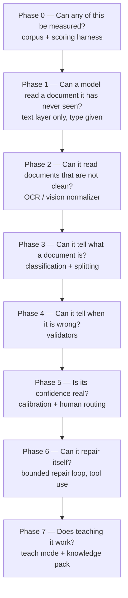
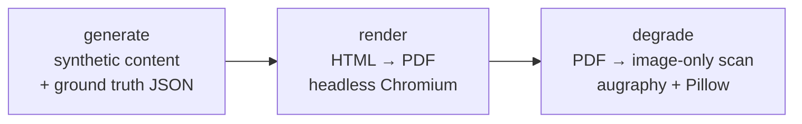
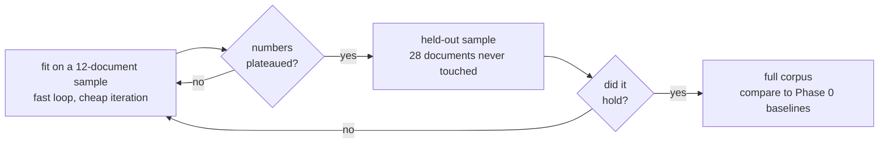
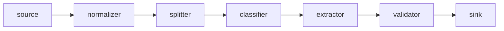

# I Built a Document Intelligence System. The Model Wasn't the Hard Part.

_How I took local-LLM document extraction from 92.8% to 98.6% by fixing the system around the model instead of replacing the model._

@@FIG hero.png | The final scorer run. Every gain over the 0.928 baseline came from fixing the system around the model, not from a larger one.

I spent years building RPA automations. The pattern was usually the same: a document comes in, a person reads it, they type what they read into another system, and I build a robot that clicks the same buttons they clicked.

The robot is fast, consistent, and completely blind. It does not actually understand the document. It just knows what to do after somebody else has already understood it.

**DocumentIntelligence** is my attempt to build the part that was missing. More importantly, I wanted to build it in a way where I could defend whether it worked with measurements instead of a few impressive demos.

This post covers the first two phases of that work: building the evaluation system first, then building the simplest useful extractor I could point at it.

The headline result is that extraction accuracy moved from `0.928` to `0.986` across the graded corpus. What is much more interesting is why.

**Not one of those improvements came from changing to a better model.**

Every significant defect I found was mine: the schema, the prompts, the document generator, the scoring system, or the assumptions surrounding them. In several cases, the model had been reading the document correctly the entire time. I was just asking the wrong question and then grading it as if I had asked the right one.

That ended up becoming the main lesson of Phase 1.

---

## What I am actually building

The end state is a web application where a user can upload documents individually, upload a ZIP, or point the system at a network share and get structured data back.

Invoices become vendor, invoice number, dates, totals, line items, and other fields. Forms become their fields. Purchase orders become structured purchase-order data.

The system has two primary operating modes.

**Learning mode** puts documents into a human review queue. The user corrects mistakes while doing normal review work, and those corrections become training data for the system. Teaching should be a side effect of clearing the queue, not another job somebody has to remember to do.

**Agentic mode** processes batches unattended, accepts what it has enough confidence in, and routes questionable results to a person.

The architectural rule I settled on is what I call a **deterministic spine with agentic pockets**.

Ordering, persistence, routing, retries, export, and the rest of the workflow are ordinary deterministic code. They are replayable, inspectable, and auditable. Model judgment is confined to the places where fixed code genuinely cannot solve the problem: extracting difficult documents and, eventually, a bounded repair loop where the model receives a document plus specific validation failures and gets another attempt.

I do not want an agent deciding what to do at every stage of the pipeline. Besides being harder to debug, that would destroy the reproducibility needed to measure whether the system is actually improving.

The system also ships knowledge rather than model weights. A knowledge pack can contain things like type definitions, sender layout profiles, correction memory, learned validators, and calibration data. A new installation can therefore start with useful knowledge without requiring a custom fine-tune.

More importantly, that knowledge is inspectable. You can read a sender profile or a validator. You cannot meaningfully inspect a fine-tuned weight matrix and understand why the system behaves differently.

The implementation is Python and Docker Compose. Every pipeline stage runs as a container behind a Compose profile, so nothing starts unless it is needed. The generator, extractor, scorer, and later stages all have the same basic execution model, which makes the pipeline reproducible on a clean machine.

---

## Phase 0: Build the ruler before building the thing being measured

I broke the project into eight phases and ordered them by **risk retirement**, not by which features sounded the most interesting.

Each phase is supposed to answer a question that could potentially kill the project, and each one should end with a number rather than a demo.



Phase 0 is the scoring harness. It comes first for a pretty simple reason: if I build the extractor before I can measure it, I have no reliable way of knowing whether the next change makes it better or worse.

Without that, development turns into "this output looks better to me," which is not a measurement strategy.

I created two baselines.

**`selftest`** feeds the ground truth back into the scorer as the prediction. It must return exactly `1.000`. If it does not, the scorer or one of its normalizers is broken. That gives me a hard check that the measurement system can at least recognize a perfect result.

The second baseline is more interesting.

**`score --predictions empty`** grades an extractor that successfully runs but extracts absolutely nothing.

That does not score zero.

Some documents in the corpus intentionally contain missing fields. An extractor that returns nothing therefore gets credit for "correctly" agreeing that those fields are blank. The raw empty-extractor score is `0.007`, while the accuracy excluding blank fields is `0.000`.

That tiny gap is exactly why I wanted Phase 0 before anything else. Without the empty baseline, I could easily have been reporting a number with free points baked into it and never noticed.

The reports are also sliced by document type, layout, and degradation profile. A single blended score is useful as a headline, but it can hide the exact thing I care about, like getting nearly perfect results on clean invoices while completely failing faxed forms.

---

## Building a document corpus I could actually publish

I did not want to use real business documents. Real invoices contain real companies, account numbers, addresses, amounts, and people's information. A portfolio repository that somebody can clone should not contain any of that.

So I built a synthetic document generator.

It generates five document types:

* invoices
* purchase orders
* multi-bill invoices
* resumes
* HR, tax, and loan forms

Each type has multiple layouts, and the generator writes ground-truth JSON alongside every document.

The entire process is seeded, so the same seed creates the same corpus. That became much more important than I expected once I started fixing defects and trying to determine whether a change had actually improved anything.

The generation pipeline has three stages:



### Making documents that have had a bad life

Clean vector PDFs with a perfect text layer are the easiest possible version of this problem. A document extractor that only works there is not very useful.

Real business documents get faxed, scanned, printed and rescanned, photographed on phones, compressed by email systems, and generally abused.

I use **augraphy** for print-and-scan simulation and Pillow for geometric distortion. I currently generate three degradation profiles.

* **light** represents a decent office scanner with minor noise and compression.
* **fax** is the worst realistic case: 170 DPI rasterization, heavy bitonal thresholding, scan lines, and thermal-paper-style degradation.
* **photo** simulates a phone image with perspective distortion, uneven lighting, shadows, and a slight crinkle in the page.

The degraded files are intentionally **image-only PDFs with no text layer**. That forces the system through the OCR or vision path later instead of accidentally testing the easy version.

@@FIG degradation.png | The same document under four conditions. Clean is a vector PDF with a perfect text layer; light, fax, and photo are image-only scans with no text layer at all.

Getting the degradation pipeline working was more annoying than the diagram makes it look. Some augraphy numba kernels crash on certain installations, so I disable JIT at import. One noise generator has a float-indexing problem in a particular mode, so I pinned around it.

My original degradation settings were also too good at their job. The documents were basically unreadable. I retuned them twice and raised fax resolution from 100 to 170 DPI because a benchmark that nobody can pass is not measuring anything useful.

I also inject actual document defects: blank fields, totals that do not foot, invalid dates, and similar problems. Those will become inputs to the validator phases later.

One of the uglier generator bugs involved multi-bill documents. I injected defects and then a later rollup function quietly recalculated the values and repaired them. The corpus said a document was defective when the rendered document was actually correct.

Fixing it required changing the order of generation and then verifying across 300 documents that every defect tag still represented something observable. That change also moved the RNG stream and changed all the documents after it, so I had to place the fix where the output remained byte-identical for the same seed.

None of this is particularly glamorous, but it is the difference between a benchmark I can trust and one that is confidently lying to me.

The final generated corpus currently contains **352 clean documents and 1,056 degraded variants**. I do not commit the generated files themselves. They are reproducible from a seed, and putting 229 MB of rasterized PDFs into a repository somebody is supposed to browse would just be obnoxious.

---

## The document type that broke my original data model

The most interesting document type so far has been the multi-bill invoice.

It started as another test case and ended up forcing changes to the schema, scorer, prompt, and how I think about extraction failures.

A normal invoice maps pretty naturally to a flat structure. There is a vendor, invoice number, date, total, and perhaps a repeating line-item group.

A **multi-bill invoice** is different. One physical document can contain multiple independently payable services. A facilities vendor might invoice electricity, waste removal, and snow clearing together.

Each service can have its own account number, service code, reference number, billing period, cost center, site address, subtotal, tax, total, and line items.

The structure therefore looks like this:

```text
document
├── vendor, invoice number, dates, master account, grand total
└── sections[]
    ├── account_number, service_code, reference_number
    ├── service_type, cost_center, service_location
    ├── service_period_start, service_period_end
    ├── subtotal, tax, total
    └── line_items[]
        └── description, quantity, unit_price, amount
```

That is a repeating group containing another repeating group.

@@FIG multibill.png | A real multi-bill invoice from the corpus. One document carries multiple independently payable services, each with its own account, service code, reference, meter, and cost centre, and its own subtotal rolling up to a grand total.

It forced four changes to the system.

First, **the schema had to become recursive**. The type registry now supports groups containing other groups, and the JSON Schema sent to the model is generated from that same declaration. The extractor and scorer therefore cannot quietly develop different definitions of what a multi-bill invoice looks like.

Second, **the scorer has to match rows before comparing fields**. If truth contains three sections and the model returns three sections, I cannot assume they came back in the same order. The model might reorder them, omit one, or invent one. Sections are matched using declared key fields before individual fields are scored.

Third, **row recall needs to be separate from field accuracy**. Missing an entire payable service is fundamentally different from misreading a field inside a service the model successfully found. Combining those failures into one percentage hides the one that matters more financially.

Finally, this structure is simply more difficult for the extractor. Three identifier fields can look almost identical, sit next to one another, and repeat several times on the same page.

That exposed several problems very quickly.

---

## Multi-bill accuracy was 56.7%, and I blamed the model

The initial multi-bill result was terrible: `0.567` field accuracy compared with roughly `0.966` to `0.977` for the other document types.

My immediate assumption was that multi-bill documents were genuinely harder and I probably needed a larger model.

That assumption turned out to be wrong seven times in a row.

### 1. Three identifiers had effectively the same description

`service_code`, `account_number`, and `reference_number` all inherited the same generic identifier description.

The model rotated them. Values that belonged in one field appeared in another.

`service_code` scored exactly `0.000`.

A field scoring exactly zero is interesting because it often means the model is not randomly confused. It may be consistently answering a different question than the one I think I asked.

### 2. Two layouts never printed the field

I gave the three identifiers distinct descriptions and `service_code` remained at `0.000`.

The reason was simple: two of the three document layouts wrote the value to ground truth but never rendered it onto the actual PDF.

I was grading the model on information that did not exist on the page.

The model was correct not to find it.

### 3. I printed the value but did not label it

After fixing the renderer, `service_code` improved to `0.472`.

The value was finally on the document, but nothing identified what it was. The extractor therefore grabbed nearby text.

That is not really a model problem either. A value that a human has to identify entirely from column position requires the model to make the same inference.

### 4. I labeled it the way a real bill would

Accuracy: `1.000`.

The progression was:

| Round               | `service_code` accuracy | Actual problem                           |
| ------------------- | ----------------------: | ---------------------------------------- |
| baseline            |                 `0.000` | three identifiers shared one description |
| unique descriptions |                 `0.000` | field missing from 2 of 3 layouts        |
| rendered            |                 `0.472` | value existed but was unlabeled          |
| properly labeled    |                 `1.000` | resolved                                 |

Four rounds of debugging one field, and every problem was mine.

### 5. I asked the model to extract furniture

I also had a `reference_label` field. This represented words such as `METER` or `CIRCUIT` printed before an identifier.

When asked to extract it, the model sometimes returned something like:

`METER M3947745`

That actually makes sense. On the page, `METER` is not really a standalone value. It is the label for `M3947745`.

I removed `reference_label` from the extraction schema and left it only in the corpus as metadata describing the generated document.

That was an important distinction: **something can be a fact about a document without being a field that should be extracted from the document.**

### 6. A label was also the prefix of its value

One synthetic vendor used `BOL` as the label for a bill-of-lading number, while the actual identifier looked like `BOL-2396818`.

The rendered document therefore said:

`BOL BOL-2396818`

There is no clean way to infer where the label ends and the identifier begins. I changed the rendered label to `Bill of lading`, removing the ambiguity.

If a human cannot reliably tell what the correct answer is, it is not a fair extraction test.

### 7. My own description contradicted itself

`reference_number` plateaued at `0.778`, and the errors were extremely consistent.

The model returned something like:

`Bill of lading C-59602`

when the expected value was:

`C-59602`

The field-specific description said the identifier was the value **printed after its label**.

Then the generic identifier text appended by my schema builder said:

> Identifier exactly as printed, including any prefix.

Those instructions conflict.

I wrote "including any prefix" because I wanted the model to preserve the `INV-` in something like `INV-4471`.

The model interpreted it as "preserve text appearing before the identifier."

That is a completely reasonable interpretation of the instruction I wrote.

After fixing these issues, multi-bill accuracy moved from `0.567` to `0.983`.

**None of that improvement came from a better model.**

---

## Testing whether a bigger model actually helped

The extractor talks to an OpenAI-compatible endpoint, so switching models is just a TOML manifest change.

That made it easy to run an actual model ablation using the same 12 documents and the same prompts.

| Model            | Completed | Output tokens | Wall clock | Notes                    |
| ---------------- | --------: | ------------: | ---------: | ------------------------ |
| `qwen3-vl-8b`    |     12/12 |        10,769 |       684s | baseline                 |
| `qwen3-vl-30b`   |     12/12 |        10,309 |       581s | worse in the same places |
| `deepseek-r1-8b` |      3/12 |        82,210 |     4,393s | 95.7% reasoning output   |

### The bigger model was worse

Going from 8B to roughly four times the parameter count did not improve extraction. It made several fields worse.

More importantly, the failures happened in the **same places**.

The 30B truncated cost centers more frequently and introduced two subtotal arithmetic errors that the 8B got right.

The most useful result came from a field that was hallucinating values when the source document did not contain one.

The 8B invented exactly **16** values.

The 30B invented exactly **16** values.

Not approximately 16. Exactly the same number.

If I quadruple the model size and a failure variable does not move at all, I stop treating that variable like a model-capability problem.

That result probably saved me weeks of messing around with larger models.

---

## Reasoning models are not automatically better extractors

I also wanted to test a reasoning model.

The idea was reasonable: maybe a reasoning model would look at the value it extracted, compare it with the field definition, and catch some mistakes before returning it.

That is not what happened.

`deepseek-r1` generated **82,210 output tokens**, of which **78,696 were reasoning tokens**.

That is **95.7% of all output**.

Nine of the twelve documents exhausted the token budget before the model produced a usable result. It took 6.4 times as long as the 8B model and successfully finished one quarter as much work.

For this part of the pipeline, extraction is mostly transcription. The value is already printed on the document. Spending thousands of tokens reasoning about whether `INV-4471` is really `INV-4471` mostly creates latency and gives the model more opportunity to reinterpret something I asked it to copy.

There is one important caveat. The reasoning model ran unconstrained because that endpoint rejects my nullable schema types, so its accuracy is not a clean apples-to-apples comparison.

Its **token consumption and completion rate**, however, are still real.

I do think reasoning belongs later in the pipeline.

If the validator says:

> These line items total 4,102.50 but the document says 4,120.50.

then there is actually something to reason about.

That is what the Phase 6 repair loop is for.

---

## Fit first, then hold out, then run the corpus

I deliberately use three stages when developing extraction behavior.



I **fit against a small sample first** because iteration speed matters. Twelve documents take minutes. A full corpus run takes more than an hour.

It would be stupid to repeatedly run the whole corpus while debugging something obvious like a missing field label.

The obvious risk is overfitting the harness or prompt to those twelve documents, so once the numbers stopped moving I ran the extractor against 28 multi-bill documents it had never seen during development.

| Field              | Fitted sample |          Held out |
| ------------------ | ------------: | ----------------: |
| `reference_number` |       `1.000` |           `1.000` |
| `cost_center`      |       `0.778` |           `0.800` |
| `service_location` |       `0.556` |           `0.600` |
| line items         |       `1.000` | `1.000` / `0.995` |

There was no collapse on the held-out set.

Even the weak fields stayed weak at roughly the same rate, which was actually useful. It suggested those remaining errors represented something structural about the task rather than something I accidentally fit to the sample.

Only after that did I run the complete corpus.

### I also managed to break sampling

Originally, `--limit 12` effectively meant:

```python
records[:12]
```

The first twelve form records happened to all be onboarding forms.

For an entire day, every "quick regression test" on forms tested onboarding forms and nothing else.

Claims forms, W-9s, W-4s, and loan applications were invisible.

That is how a field that fabricated co-applicant names on 25 loan applications survived a full day of regression testing.

There was never a loan application in the sample.

Sampling is now deterministic round-robin across variants. `--limit 5` and `--limit 40` both give a balanced sample rather than whatever happened to occur first in the manifest.

---

## The pipeline is built around plugins

The architecture uses named plugin slots for every major stage.

The direct inspiration is [DeepSeek's Harness](https://deepseek.com/harness/en/), where the entire system is built from interchangeable components rather than a fixed core with a few extension hooks attached.



That distinction matters.

A system that is merely "extensible" usually develops a privileged core. Special cases slowly accumulate there because the extension API cannot quite express what somebody needs.

I wanted the slot itself to be the contract. A component either implements it or it does not.

Three parts of that design have already paid off.

### Configuration belongs to the plugin

Each plugin declares the settings it accepts, including the name, type, default, help text, and whether the value is secret.

Precedence is:

`default < manifest < namespaced environment variable < CLI flag`

Unknown manifest keys cause a hard error with a suggested correction. A configuration value that looks valid but is silently ignored is much worse than a process refusing to start.

Every report records the resolved configuration with secrets redacted, which means a score can always tell me exactly what produced it.

Running:

```text
extract.cli config
```

shows every plugin and its configuration surface.

That caught another embarrassing problem. My committed manifest referenced a model the endpoint had never actually served and pointed at the wrong base URL.

I never noticed because my local environment overrode both values.

The project worked perfectly for the only person who already knew how to fix it and would have failed immediately for somebody cloning the repository.

I added:

```text
config --check
```

which asks the endpoint whether the configured model actually exists and exits non-zero when it does not.

### Deterministic cleanup is also a plugin

Some post-processing does not need a model.

A totals row is not a line item. A row with no description, quantity, or amount is not a line item either.

Those facts are deterministic, cheaper to enforce in code, and easier to audit.

Cleanup rules therefore live in a registry. Each rule declares which document types it applies to and reports exactly how many values it changed. That count is attached to predictions and included in run summaries so I can distinguish what the model extracted from what deterministic cleanup repaired.

One rule I particularly like is `strip_identifier_labels`.

A document may contain:

```text
METER M3947745
```

and the model may return the entire string instead of just:

```text
M3947745
```

The reason I am comfortable making that a rule is that I can state a stronger invariant:

**Identifiers in this corpus are single tokens.**

I checked all 701 identifier values. None contain a space.

That means a multi-token identifier is not an unusual identifier. Something has been attached to it.

The test suite pins that assumption. If a future corpus introduces valid identifiers containing spaces, the test fails before the cleanup rule quietly starts corrupting data.

The rule is intentionally conservative. Every token before the last must be alphabetic, and the final token must contain a digit.

So:

```text
Bill of lading C-59602
```

can become:

```text
C-59602
```

but ambiguous cases are left alone.

There is an important boundary here.

A rule can fix something that is wrong **by definition**.

It should never "fix" model judgment.

If the sum of the line items disagrees with the stated invoice total, I do not want a cleanup function changing the invoice total. That disagreement is exactly the kind of thing the validator should report later.

Otherwise the extractor's score improves while the actual system becomes less trustworthy.

The test I use is:

**Could I describe this correction as a fact about the document format without talking about what the model probably meant?**

If I cannot, it is not a deterministic cleanup rule.

### Model backends are plugins too

Because extraction backends use the same plugin system, the model ablation above required a manifest edit instead of a refactor.

Backend-specific quirks can also remain inside the backend. For example, one endpoint rejects nullable union types with a 400 response, so that backend can fall back to putting the schema into the prompt without changing behavior for every other model.

---

## Abstention was the most important problem I found

The failure that probably taught me the most had nothing to do with incorrectly reading text.

It happened when the correct answer was **nothing**.

Three fields were inventing data when the source document did not contain a value:

* `co_applicant_name` generated a person on all **25** loan applications without a co-applicant.
* `business_name` generated one on 15 of 16 absent cases.
* `service_location` populated **all 46** absent cases, with 37 copied directly from a neighboring field.

The service-location problem is especially common on multi-bill invoices.

Not every service has a physical service address. A phone line or software subscription is not necessarily delivered to a street address.

The correct answer may simply be:

**There is no service address on this section.**

Instead, the model would often grab the nearest plausible-looking string, such as a cost center or meter identifier.

### Missing data and wrong data are not equally dangerous

A blank field is visible.

Somebody reviewing the result sees the blank and knows they may need to investigate it.

A plausible wrong value looks finished.

If `CC-8090 IT` lands in an address column, it can flow through another system without anyone realizing there was a problem.

For something that routes work by location, allocates expense to a site, or verifies where a service occurred, a convincing wrong address may be considerably worse than no address.

That distinction later changed the scorer.

### Rewriting the prompt did not solve it

I rewrote the descriptions three times.

Eventually the description explicitly told the model that most sections do not contain a per-service address, that `null` is often the correct answer, and even described the kinds of neighboring values it should not use.

The fabrication count stayed:

`16 → 16 → 16`

The 30B model also produced:

`16`

Meanwhile, `ssn` and `ein` were abstaining perfectly.

Those fields are mutually exclusive on a W-9. A form contains one or the other, never both.

The extractor returned no value for the absent field in all 20 cases with zero false positives.

That observation mattered because it proved the model was capable of representing absence. It was doing it perfectly in one context and refusing to do it in another.

So I stopped treating the problem as a general model limitation.

---

## The fix was changing the shape of the answer

The structured-output interface requires every property to appear as required.

The value itself can be nullable, but the **slot** is still mandatory.

So the model receives something conceptually like:

> Give me `service_location`. This answer is required. It may be null.

That creates pressure to provide something.

The prose can say "null is perfectly acceptable" all day, but the structure still says "I need an answer for this field."

I changed the representation for fields that are legitimately optional.

Instead of:

```json
"service_location": null
```

the model now answers a small decision:

```json
"service_location": {
  "status": "present | absent | unclear",
  "value": null
}
```

Same model.
Same documents.
Same basic prompt.

| Field                 | Absent cases | Invented before | Invented after |
| --------------------- | -----------: | --------------: | -------------: |
| `co_applicant_name`   |           25 |         `1.000` |    **`0.000`** |
| `business_name`       |           16 |         `0.938` |    **`0.000`** |
| `service_location`    |           46 |         `1.000` |    **`0.413`** |
| `ssn` / `ein` control |           20 |         `0.000` |        `0.000` |

@@FIG abstention.png | Invented values on absent fields collapsed once optional fields returned a typed present / absent / unclear decision instead of a required, nullable slot. Same model, same prompt.

The outright fabrication problem disappeared completely for `co_applicant_name` and `business_name`.

I deliberately left `co_applicant_name` without a field description during this test. I wanted the typed decision itself to be the variable.

`service_location` improved dramatically but is not solved. When another value sits immediately beside the field on the page, the model still borrows it in around two out of five absent cases.

That is still an open problem.

Internally, the extractor collapses the decision object back to the normal field representation before downstream processing, so the rules, scorer, and stored data do not need to understand two different schemas.

`unclear` ultimately becomes no value, but I keep it distinct at the model boundary because it should become useful when confidence routing arrives in Phase 5.

---

## Grounding is the next version of this idea

The stronger version of abstention is **field grounding**.

Instead of returning only a value, the model also has to return the evidence it used.

For example:

```json
{
  "cost_centre": {
    "value": "CC-8090 IT",
    "evidence": "Cost Centre: CC-8090 IT"
  },
  "service_address": {
    "status": "absent",
    "value": null
  }
}
```

That gives me a few useful properties.

If two extracted fields contain the same value, I can compare their evidence. One may point to a clearly labeled source while the other cannot.

More importantly, **the evidence itself can be checked deterministically**.

If the model claims:

```text
Cost Centre: CC-8090 IT
```

is evidence from the document, I can verify that string exists in the text layer.

A fabricated justification fails a substring check.

That is much more useful to me than asking the model whether it feels confident about its own reasoning.

It converts part of an otherwise probabilistic judgment into something I can test.

---

## Accuracy alone was hiding the most expensive error

A major lesson from this phase was that a single field-accuracy number is not enough.

An accuracy metric usually gives the same penalty to:

1. a value that was present but missed, and
2. a value that never existed but was invented.

Operationally, those can have very different costs.

`service_location` originally scored `0.556`.

Inside that one number were multiple completely different failure modes: invented addresses, correct values returned with labels attached, and actual misses.

Those failures require different fixes, but the aggregate score made them look identical.

Optional fields are now reported with additional metrics:

* **presence accuracy** — did the extractor correctly determine whether the field existed?
* **precision when populated** — when it returned something, how often was that something real?
* **recall on present** — how many real values did it recover?
* **false-positive rate on absent** — how frequently did it invent a value when none existed?
* **contamination rate** — how often did that false value come directly from another nearby field?

The embarrassing part is that most of the necessary data already existed.

The scorer had tracked a `spurious` counter from its first version:

> prediction had a value, truth did not.

It was already written to the JSON report.

I just never displayed it.

The human-readable report used an `elif` chain that could show `missing`, while the nested group table did not even have a note column.

So the most important diagnostic in the system was being calculated correctly, stored correctly, and then thrown away at rendering time.

It remained invisible through a complete corpus run and seven commits.

As soon as I displayed it, multiple broken fields became obvious.

The measurement was not wrong.

**My measurement UI was hiding the measurement.**

That is a failure mode I will probably pay much more attention to in future systems.

I also mutation-tested the new metrics by deliberately breaking their calculations and checking whether a test failed.

Changing the false-positive denominator was caught by three tests.

Changing the contamination-rate formula was caught by **zero**.

I had tested the underlying counter but never asserted the final rate shown to the user.

That test exists now.

---

## Why this matters beyond getting a better score

It would be easy to look at all of this as obsessive metric cleanup.

I do not think it is.

Every later phase depends on the quality of the extraction result.

A validator cannot automatically tell whether a disagreement comes from a defective document or a bad extraction. If the invoice total does not equal its line items, that could mean the invoice is wrong or the extractor misread a number.

Without trustworthy extraction, the validator accuracy is polluted.

Confidence calibration has the same problem. If a particular field is structurally wrong 40% of the time because I designed its schema badly, the confidence system may simply learn that the entire field is unreliable. It cannot learn the distinction I actually care about.

The worst case is the learning loop.

If I had shipped the version that fabricated service addresses and let humans correct it in Learning Mode, the system would appear to improve.

The knowledge pack would accumulate thousands of corrections.

Accuracy would go up.

The system would be "learning."

Except people would actually be spending their time compensating for a schema defect that I later fixed with a structural change.

I could have paid humans indefinitely to train around a bug in my own extraction contract.

That is the type of failure I most want this architecture to prevent.

It also changes what I mean when I say learning should improve the system.

Learning is useful for information I cannot know generically:

* this vendor puts its invoice number in the footer;
* this customer never charges tax;
* this sender's layout puts total where other vendors put subtotal;
* this document family has a recurring weird convention.

That is real document-specific knowledge.

None of the defects described in this post needed learning.

They were malformed questions.

Training a model against a malformed question does not fix the question. At best, it teaches the model to compensate for it.

---

## Phase 1 results

Because the scorer itself changed during development, I reran both the original predictions and final predictions through the current scorer.

Comparing scores generated by two versions of the scorer would make the result meaningless.

| Slice                               | First baseline | After Phase 1 |
| ----------------------------------- | -------------: | ------------: |
| **overall field accuracy**          |        `0.928` |   **`0.986`** |
| purchase orders                     |        `0.966` |   **`1.000`** |
| multi-bill invoices                 |        `0.567` |   **`0.983`** |
| forms                               |        `0.977` |   **`0.987`** |
| invoices                            |        `0.976` |       `0.979` |
| empty-extractor baseline, non-blank |        `0.000` |       `0.000` |

The final graded corpus result is **`0.986`**, up from `0.928`, across 315 graded documents covering all five document types.

@@FIG accuracy.png | Field accuracy by document type, first baseline versus after Phase 1. The multi-bill jump from 0.567 to 0.983 carried the overall number.

There are two caveats.

### Most resumes did not finish

Only 3 of the 40 resumes made it into the completed run.

One resume caused the model to generate **49,853 characters** where a normal prediction is roughly 400 to 900 characters. It hit the token cap while still looping.

That is not a problem that gets fixed by increasing the token budget. Increasing the budget lets the failure continue for longer.

I stopped the run rather than spend another 90 minutes confirming something that was already obvious.

Resumes were also the weakest document type at `0.832`, so excluding most of them mechanically improves the overall average.

The `0.986` number is real for the documents that completed, but it is slightly generous as a representation of the entire corpus.

The four complete types moved:

* purchase orders: `0.966 → 1.000`
* multi-bill: `0.567 → 0.983`
* forms: `0.977 → 0.987`
* invoices: `0.976 → 0.979`

Those numbers do not carry the resume caveat.

### Service-location abstention is improved, not solved

The `service_location` false-positive rate on absent fields is still `0.413`.

That is dramatically better than `1.000`.

It is also nowhere near done.

The test suite currently contains **212 tests**. Claims in this project like "all identifiers in the corpus contain no spaces" are encoded as tests, so assumptions that make the algorithms valid cannot silently stop being true later.

---

## What comes next

**Phase 2 is the normalizer.**

The corpus already contains 1,056 degraded documents waiting for it.

Right now, the extractor reads **zero characters** from those documents because they intentionally contain no text layer.

That is the correct Phase 2 starting point.

I do not want to pretend "degraded-document accuracy is low." The extractor cannot currently see them at all.

OCR and vision will become competing implementations of the normalizer plugin. Because the same synthetic document exists under known degradation profiles, I can run them against identical inputs and directly measure where OCR, vision, or a combination performs best.

That should be a much cleaner comparison than most OCR benchmarks because I control both the ground truth and exactly how the page was damaged.

I also want to put an **extractive model** into the extractor slot as another ablation.

That is interesting specifically because of the abstention problem.

A generative model can invent a co-applicant name.

A model constrained to selecting spans from the source cannot invent a name that is not there.

Its absence behavior is therefore different by construction rather than because I told it very strongly not to hallucinate.

Comparing **generative extraction with typed abstention** against **extractive extraction with source-constrained spans** is exactly the kind of experiment I built the harness to support.

---

## The actual lesson from Phase 1

I started this project trying to answer a straightforward question:

**Can a local model reliably extract structured data from business documents?**

The more useful thing I learned is that, at least for this class of problem, **the model is frequently not the bottleneck**.

I had seven consecutive defects in one document type, and all seven were mine.

One field scored zero because three identifiers had the same description. It still scored zero because the generator did not print it. Then it scored badly because I printed the value without a label.

Another field had contradictory instructions inside its own generated description.

I asked the model to extract information that was really metadata about the document.

I built a diagnostic counter, correctly calculated it on every run, stored it in every report, and then forgot to display it.

I built a sample mode that was supposed to provide quick representative regression runs and accidentally made it test the first document subtype over and over.

Meanwhile, making the model four times larger made extraction worse in many of the same places, and the reasoning model spent 95.7% of its output budget thinking before failing to finish three quarters of the sample.

The work that actually moved the numbers was mostly specification and measurement work.

I made the questions answerable. I made sure the values I expected were actually printed. I gave absence an explicit representation. I separated expensive false positives from harmless misses. I made cleanup rules prove the assumptions that justify them. I made the scorer show the information it was already collecting.

The result went from `0.928` to `0.986`.

The model did not suddenly get smarter.

**I got better at asking it questions I could fairly grade.**

That is probably the most important thing this project demonstrates, and it is the part of the work I would bring to a team.