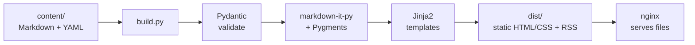

# WordPress Pushed Me Into Building My Own Site Generator

_A serious vulnerability in WordPress Core was the final nudge, but the truth is I also wanted an excuse to build something interesting. That became ContextPress, a small Python static site generator built around Markdown, YAML, templates, and a simple build pipeline. Merge into main, and the new version publishes itself._

@@FIG wordpress-security-tax-hero.png | The trade I was actually making: babysitting a tangled, always-running application on one side, and a quiet stack of pre-generated files on the other. Replacing WordPress with a static site removes the attack surface instead of patching it.

I ran this site on WordPress for a long time and, honestly, it worked fine. I wasn't one of those people who hated WordPress or thought it was bad software. It did what I needed it to do.

Then a serious vulnerability showed up in WordPress Core. This wasn't some random plugin I installed or a theme I could remove. It was the platform itself. That meant patching it, checking that everything still worked, watching for more information about the vulnerability, and wondering how many automated scanners were already hitting WordPress sites looking for it.

At some point I started asking why I was doing any of this.

I was maintaining a dynamic PHP application backed by a database, with an administrative interface exposed to the internet, so that I could publish what is basically a collection of articles that almost never change after I post them. I was paying a permanent security and maintenance tax for capabilities I barely used.

That trade stopped making sense.

So I did what I tend to do when something annoys me enough and also looks like it might be fun to build: I replaced it.

The result is ContextPress, a small Python static site generator. This is how it works, why I built it the way I did, and how merging a pull request eventually turns into the page you are reading.

## The problem with WordPress was never really WordPress

WordPress is an impressive piece of software. It powers an enormous part of the web, has a huge ecosystem, and can be turned into almost anything.

My problem was that I didn't need almost anything.

Every request to a traditional WordPress site involves a PHP application talking to a database. There is an admin interface. There are authentication paths. There are plugins running code inside the same application. There are updates, dependencies, configuration, and a lot of moving parts that all exist because WordPress needs to support sites far more complicated than mine.

That is a lot of executing, internet-facing software for something whose primary job is showing you text I wrote last week.

When the vulnerability was in Core, my usual way of thinking about the problem stopped helping. I couldn't uninstall the vulnerable plugin because there wasn't one. I couldn't swap out the theme. The thing I was trying to protect was the platform itself.

So I changed the question.

Instead of asking, "How do I keep securing this dynamic application?" I started asking, "Why does there need to be an application there at all?"

For my site, there really doesn't.

A static site can just be HTML and CSS generated ahead of time and served by nginx. There is no PHP process handling each request, no database query behind the page, and no login screen on the public site. What the internet sees is basically a directory full of files.

You cannot SQL inject a folder.

@@FIG hero.svg | The same website, two architectures. The dynamic stack keeps PHP, a database, an admin login, and plugins executing on every request; the static version is pre-built files that nginx just hands out. Removing the runtime removes the attack surface instead of patching it.

Of course, something still has to turn my Markdown into that folder. That became ContextPress.

## How ContextPress works

ContextPress is a static site generator. Content goes in, a complete website comes out, and nothing application-like needs to run in production. nginx just serves the generated files.

The pipeline is intentionally pretty boring:



Walking through it from left to right:

* `content/` contains the site itself as plain text. Posts are Markdown files with YAML frontmatter. Global configuration lives in `site.yaml`, and sections are described with their own `index.yaml` files. There is no content database. The filesystem is the database and `git` is the history.
* `build.py` is the entry point. It loads the content and configuration, validates everything, renders the Markdown, applies the templates, and writes the finished site into `dist/`.
* [Pydantic](https://docs.pydantic.dev/) defines the schema for the content and configuration. Every post and configuration file has to parse into a typed model before it gets rendered. If something is wrong, I want the build to fail loudly instead of quietly publishing a broken page.
* [markdown-it-py](https://github.com/executablebooks/markdown-it-py) and [Pygments](https://pygments.org/) handle Markdown rendering and syntax highlighting.
* [Jinja2](https://jinja.palletsprojects.com/) handles presentation. Templates live inside self-contained theme bundles, so the content and the site's visual presentation are separate. Changing the `theme:` value in `site.yaml` can re-skin the whole site without changing the content.
* `dist/` is the finished product. Static HTML, CSS, RSS, and the other generated files all end up there. That directory is what eventually gets published.

<figure class="post-figure fig-right">
  
  <figcaption>Content in, a validated build, a finished site out — the generator does the work once, ahead of time.</figcaption>
</figure>

The important part of the architecture is where the complicated work happens.

Parsing content, validating schemas, rendering Markdown, generating navigation, building feeds, and applying templates all happen at build time. None of that work happens when someone visits the site.

By the time nginx receives a request, the interesting work is already over. It opens the requested file and sends it.

That is exactly what I wanted.

## Why YAML

One question that comes up with this kind of design is why I use YAML instead of putting the configuration in a database, building an admin interface, or just using JSON.

The short answer is that content and configuration are data, and I want that data to be readable, editable, and easy to diff.

A post starts with a small amount of metadata:

```yaml
---
title: "I Stopped Paying the WordPress Security Tax"
date: 2026-08-27
tags: [Python, Static Site Generator, YAML]
description: "One-line summary shown on the index and in RSS."
---
```

Then the Markdown starts.

That gives me a few things I really like.

First, Markdown with YAML frontmatter is already a common convention for static site generators. Writing a post means opening a text file and typing. I don't need an admin panel, a database record, or a WYSIWYG editor trying to be helpful with my HTML.

Second, it keeps the configuration declarative. `site.yaml` describes what the site should look like structurally. An `index.yaml` describes a section. The generator decides how to turn that description into the finished site.

If I want to add something to the navigation or enable a feature, I can usually change a line of configuration instead of changing Python.

The other important part is validation. YAML by itself is just data, but once it gets loaded into Pydantic models it becomes a contract. If I miss a required value, use the wrong type, or put something invalid where ContextPress expects a date, the build fails and tells me why.

That failure happens before anything gets deployed.

It also works extremely well with git. If I change a title, add a section, modify the navigation, or update a setting, the pull request shows exactly what changed. The site's configuration history is just normal source control history.

JSON could technically do most of this, but I don't enjoy hand-writing JSON. It is noisy, comments are awkward, and a missing comma turns into unnecessary friction. A database would give me structured data but would lose a lot of the simplicity and visibility I wanted.

YAML sits in a pretty good middle ground. It is easy for me to write and easy for the program to validate.

## The part I like most: merging deploys the site

This is probably my favorite part of the whole project.

I didn't want building the site to be simple and then make deploying it a completely separate process I had to think about. I wanted publishing to be the natural end of the development workflow.

So every change starts on a branch. I use prefixes like `feat/`, `fix/`, `content/`, and `docs/` so it is obvious what kind of change I am working on. When it is ready, I open a pull request, look through the diff, and merge it into `main`.

From there, deployment happens automatically.


A [Gitea](https://about.gitea.com/) Action watches for pushes to `main`. When one happens, it connects to the server over SSH and runs the deployment script on the host.

The deployment process is basically:

1. Pull the merged commit.
2. Build the site into `./dist`.
3. Promote the generated files into the live webroot.
4. Archive the previous version.
5. Prune old archives.

nginx serves the webroot directly, so there is no application container to restart and no deployment process that takes the site offline while the new version starts up. Once the generated files are promoted, nginx starts serving them.

<figure class="post-figure fig-left">
  
  <figcaption>Merge to main and the change moves down the line on its own: build, safety checks, a locked-down deploy, live.</figcaption>
</figure>

There are a couple of details here that I think matter.

The first is that a failed build never becomes the live site. The generator has to complete successfully before the promotion step happens. If validation fails, rendering blows up, or I managed to break something else, the deployment stops and the last known-good version keeps serving.

The second is that the previous versions are archived. If I somehow deploy something that builds correctly but is still wrong, I have a known-good copy sitting there that I can restore without rebuilding anything.

I also didn't want the automation account to become a general-purpose way into the server. The SSH deploy key is restricted to a forced command. It can run the deployment process, but it cannot turn into an interactive shell if the automation environment gets compromised.

So the entire publishing workflow from my perspective is basically this:

I finish the change, review the pull request, and merge it.

Everything after that is plumbing.

## What I actually gained

The security issue is what pushed me to finally replace WordPress, and removing that attack surface is still one of the biggest benefits. But after using ContextPress, the thing I appreciate most is how much simpler the entire site feels.

There is no public PHP application anymore. There is no database behind every page. There is no WordPress login waiting for somebody to attack. The production website is generated files being served by nginx.

The entire site is also versioned like software because that is basically what it is. My posts, configuration, templates, themes, and generator code all live together in source control. If I want to know why something changed, I can look at the commit that changed it.

Publishing is easier too. There isn't a separate mental step where I finish writing something and then have to go deploy it. Merging the change publishes it, which removes just enough friction that I am more likely to actually write and ship things.

And maybe most importantly, I understand the entire thing.

If something breaks, I am debugging a relatively small Python project I wrote. I can follow the build from the Markdown file all the way through validation, rendering, templating, deployment, and nginx serving the result.

There isn't another giant platform underneath it that I have to understand just well enough to keep patched.

WordPress wasn't the wrong tool. It was just more tool than this site needed.

My website doesn't need a database, PHP runtime, plugin system, or public administration interface to display articles. Once I actually accepted that, the obvious architecture was to remove all of it.

ContextPress is what came out of doing that, plus my inability to see a small engineering problem without eventually turning it into a project.

The generator that built the page you're reading is [open source](https://github.com/ramonecungcodes/ContextPress).
