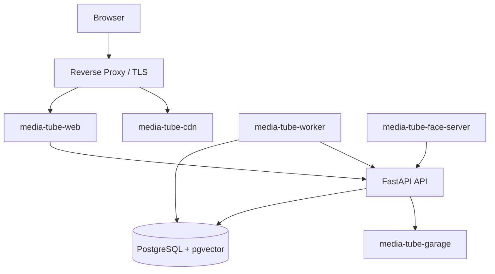
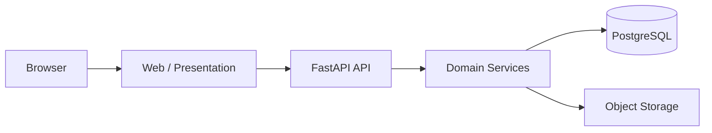
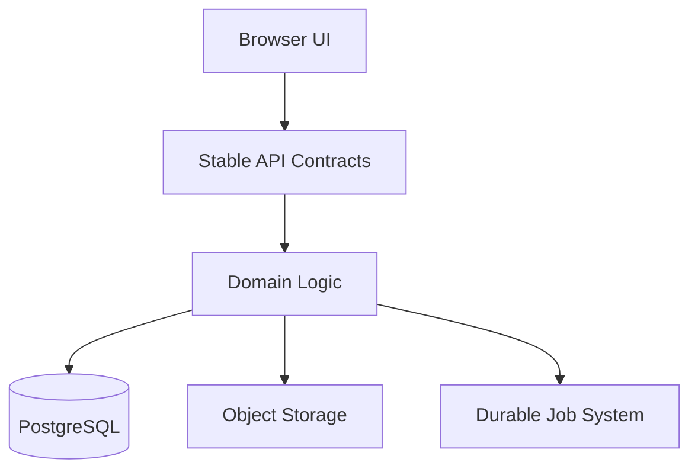
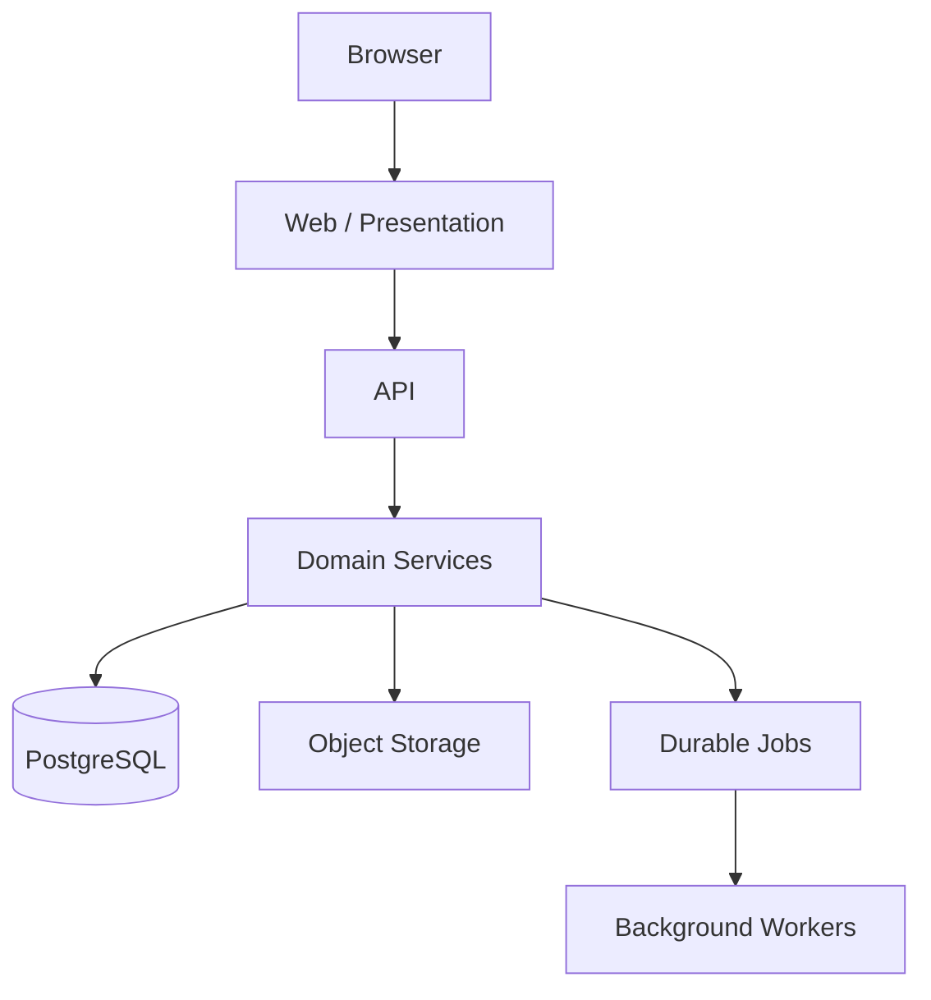

# From Three Scripts to a Private Media Platform

Media Tube started as three Python scripts. I wanted to download media, organize it, and be able to find it again later. The scripts solved that problem well enough at first, but as I kept adding features, their limitations became more obvious.

Long-running work happened inside the same process. State was often implied by files and side effects. Adding a new feature usually meant adding more logic to code that was already responsible for several unrelated things.

Today, Media Tube is a private, self-hosted media platform running on my own hardware. It has a web application, FastAPI API, PostgreSQL database, S3-compatible object storage, background workers, face detection, semantic search, AI-assisted organization, and a fairly large automated test suite.

The interesting part to me is not simply that the system now has more components. It is how the project changed as it grew, and how I have been separating responsibilities so that adding the next feature does not require making one application responsible for everything.

That work is still ongoing. Some business and persistence logic is still being moved out of the web application and into the API, and I am continuing to expand the test coverage around those boundaries as the application matures.

## What Media Tube does

Media Tube is essentially my private media environment. It handles:

* importing and downloading media
* browsing and watching videos
* tags, actors, categories, and other metadata
* albums and photos
* watch state
* subtitles
* preview generation
* face detection and grouping
* AI-assisted metadata
* lexical and semantic search

The underlying goal is fairly simple: I do not want a large media collection to eventually become a directory containing thousands of files that I technically own but cannot realistically navigate.

Playback is the easy part. The harder problems are ingesting media reliably, finding it later, maintaining enough metadata to make the collection useful, running expensive work without tying up the web application, and evolving the system without breaking unrelated functionality.

@@FIG home.png | The Media Tube home: an "Unwatched" shelf for resuming the library, plus a configurable "Topic Shelf" that filters by match rules, tags, actors, and categories.

## Architecture

Media Tube runs in Docker Compose on an always-on Dell Micro. It is deliberately not running on a large cloud environment or Kubernetes cluster. Running it on relatively modest hardware makes resource constraints visible very quickly.

If several workers begin consuming all available CPU, I notice. If every service creates an oversized PostgreSQL connection pool, I notice. If browser tests, AI processing, transcription, and production workloads all run at once, I notice.

The current architecture looks roughly like this:

The deployment uses separate Docker networks for different parts of the application. A container only joins a network when it actually needs to communicate with something on that network.

PostgreSQL is not publicly exposed. The API can reach object storage, but the browser does not receive S3 credentials or direct bucket access. The worker does not need to be publicly reachable simply because it belongs to the same application, and the face service only ever needs to talk to the API.

I did not structure the networks this way to make the Docker configuration more elaborate. The point is to reduce unnecessary access between components and limit the blast radius if one service is compromised or misconfigured.

### What each container does

**`media-tube-web`**

This is the browser-facing application. It handles routes, page behavior, and presentation. Historically it also accumulated a significant amount of data and business logic, which I am actively moving out.

**`media-tube-api`**

The FastAPI service owns domain APIs and capabilities that I do not want the browser application accessing directly, including object storage. Routes are authenticated and versioned, and required security configuration fails closed rather than allowing the application to start in an insecure state.

**`media-tube-db`**

PostgreSQL 17 with pgvector stores application state, media and library data, jobs, activity, search data, relationships, and embeddings.

**`media-tube-worker`**

The worker processes durable background jobs. Jobs use leases and heartbeats, and the worker maintains an identity so I can understand what happened across container restarts.

**`media-tube-face-server`**

Face detection and embedding generation run as a stateless service. Keeping those model dependencies outside the web and API containers reduces the runtime surface of the application services.

**`media-tube-garage`**

Garage provides S3-compatible object storage for photos and derived assets. The API sits in front of it so storage credentials remain server-side.

The reverse proxy is the public edge of the system. Browser authentication and API authentication are intentionally separate as well: browser requests use session-oriented authentication, while machine and API requests use bearer authorization.

I do not want a browser session mechanism gradually becoming a general-purpose API credential simply because it is convenient.

## Moving long-running work out of HTTP requests

One of the most important architectural changes was moving expensive work out of the web process. Downloading a video, generating previews, running transcription, processing media with AI models, or performing a large metadata backfill are not things I want tied to the lifetime of an HTTP request.

The web application should be able to request work, persist that work, and return. The worker can then process it independently.

Jobs are stored in PostgreSQL and use leases and heartbeats so a job does not remain permanently marked as running just because a container disappeared halfway through processing it.

The worker also calculates its database connection budget before startup. This may sound excessive for a personal project, but it addresses a very real shared-resource problem. The web application needs connections, the API needs connections, worker lanes need connections, and PostgreSQL still needs maintenance headroom.

If every service independently assumes it can allocate whatever pool size it wants, PostgreSQL eventually becomes responsible for arbitrating a configuration mistake. I would rather calculate the budget up front and reject an invalid configuration before the processes begin competing for connections.

The worker also receives a relatively long graceful shutdown period. On a planned shutdown, it records its state through ordinary worker code instead of attempting database operations directly from a signal handler. Container stops and restarts should be normal system behavior, not exceptional events that the architecture hopes never occur.

## AI features

I use AI in Media Tube where it provides a concrete benefit to organizing or navigating a large personal collection. Current uses include:

* semantic search
* text embeddings
* AI-assisted tagging
* metadata cleanup
* transcription workflows
* face detection and grouping

In practice that means text embeddings power semantic search over titles, descriptions, and transcripts; a chat-capable model proposes tags and cleans up messy metadata; transcription turns audio into searchable text; and the face service groups the same person across the library. None of these are the product on their own. They exist to make a large collection easier to search, organize, and rediscover.

I add these features one at a time rather than all at once. Each capability is a separate pipeline with its own failure modes, so I would rather get one working, watch how it behaves on real data, and put tests around it before starting the next. Until a feature has earned my trust, I treat its output as a suggestion to be validated, not a fact to be stored uncritically.

The model call is usually not the hardest part. The harder problem is deciding what the result means, how it should be stored, and when it should still be considered valid.

### Embeddings need provenance

A vector generated by embedding model A does not mean the same thing as a vector generated by embedding model B. They are coordinates in different vector spaces.

If vectors from different models are stored together without provenance and later compared, PostgreSQL will not stop the application from doing it. It will return similarity values, and those values may even appear plausible, which makes the failure particularly easy to miss.

Media Tube therefore treats the embedding model as part of the identity of an embedding. Changing models does not overwrite previous vectors, and search only compares vectors produced by the active model.

If I later switch back to an older model, its vectors can be reused rather than regenerating the entire library. New vectors are generated incrementally for whichever model is active. I also retain endpoint and model provenance so I know where derived data came from.

This is one of the places where the data model matters more than the AI call itself.

### PostgreSQL + pgvector

PostgreSQL was already the source of truth for the application, so pgvector was a natural choice. Media records, jobs, playback state, tags, search activity, settings, and most other relational state already live there.

Keeping vector data in PostgreSQL gives me transactions, constraints, indexes, SQL observability, established backup procedures, and one primary operational data store instead of another database that must be synchronized with the rest of the application.

For my use case, I do not currently see enough benefit in adding a separate vector database solely because some of the stored data happens to be vectors.

I also do not treat semantic search and traditional text search as interchangeable. PostgreSQL full-text search and trigram indexes are useful for exact terms, partial matches, typo tolerance, filtering, and predictable lexical ranking. Embeddings are useful when two pieces of content are conceptually related even though they do not use the same words.

Those are different retrieval problems, so Media Tube supports both.

The search system also records submitted searches, impressions, clicks, zero-result searches, and refinement chains. It deliberately does not record every character typed into the search field. I want useful relevance data without collecting partial input that does not provide much additional value.

### Face processing and object storage

Face processing runs in its own stateless service. The application sends an image and receives face detections and embeddings, which keeps model-specific dependencies out of the normal application runtime.

Face embeddings are also treated independently from text embeddings. Both are vectors, but that does not make them conceptually interchangeable or valid to compare against one another.

For photos, S3 access goes through the API rather than the browser. Original files are content-addressed using hashes, which gives me a straightforward deduplication mechanism, while thumbnails and other derived assets are stored separately.

The API also maintains reference counts for blobs so removing an image from one album does not delete the underlying object while something else still references it.

When I began migrating files into object storage, I did not immediately delete the existing disk copies. I want the replacement path to run successfully for a period of time before I destroy the rollback path.

That has become a general rule for this project: getting a new path working and proving that the old path is safe to delete are two separate tasks.

### Testing AI features as I build them

Testing AI features is different from testing ordinary code, because the model itself is nondeterministic and often slow. My approach is to pin down the parts I *can* make deterministic, test those hard, and treat the model call as a boundary I fake in most tests.

In practice that comes down to a few things.

**I test the data model, not the model's creativity.** The most valuable AI tests in Media Tube have nothing to do with answer quality. They verify that every embedding is stored with its model provenance, that switching models creates a new vector set instead of overwriting the old one, and that a similarity search only ever compares vectors produced by the same model. Those assertions are deterministic, and they guard against the failure mode that actually worries me: silently mixing incompatible vectors and getting plausible-looking but meaningless results.

**Model endpoints are an interface, so tests can fake them.** Embedding generation, tagging and metadata calls, and transcription all go through a small interface rather than calling a provider directly. In tests I substitute a fake that returns fixed or recorded vectors and responses. That keeps the suite fast and deterministic, and it lets me exercise the plumbing around the model (job enqueueing, retries, partial failures, coverage tracking, and re-indexing) without needing a model loaded at all.

**I test retrieval behavior separately from model output.** Search has two jobs: return the right things, and return them in a sensible order. I can test the mechanics with fixtures: a known set of documents and embeddings, then assertions about what comes back and in what order. Alongside that, I am building up a small hand-labeled set of queries so that when I change the embedding model or the hybrid ranking I can tell whether it actually helped rather than just felt better. That evaluation piece is still early, but treating it as its own artifact, versioned with the code, is the point.

**I test the failure paths.** Zero-result searches, an unavailable model endpoint, an embedding job that dies halfway, an image the face service cannot process: these are the cases where an AI feature quietly degrades or, worse, corrupts data. They get explicit tests, because in practice that is where the real damage happens.

I am deliberately not chasing a single accuracy number for the whole system. As I build each AI feature out, the question I try to answer with tests is narrower and more useful: did this change do what I intended, and did it avoid doing something I did not intend?

## Moving business logic out of the web application

This is probably the largest refactor happening in Media Tube right now.

Because the project grew from scripts into a web application, early browser-facing code accumulated a lot of responsibility. A route could accept a request, call another service, query PostgreSQL, apply business rules, modify state, schedule background work, and render a response.

That works, but it also makes the presentation layer the owner of nearly every concern in the system.

The target architecture is much more explicit:

The web application should primarily care about browser behavior and presentation. The API should own domain operations and data access.

I am not approaching this as a large rewrite. Domains are being moved one at a time, including areas such as:

* video state
* settings
* watch-page data
* browse taxonomy
* home-page data
* semantic search
* jobs
* administrative operations

Each migration has to leave the deployed application in a coherent state. I also do not assume that a migration is complete simply because the browser still works. Scheduled jobs, machine clients, scripts, tests, and internal callers may depend on the same behavior, so those are part of the acceptance criteria as well.

The API itself is intentionally dependency-light: FastAPI, Uvicorn, Psycopg, asynchronous S3 access, and WebAuthn support. I prefer not to add dependencies unless they solve a specific problem. A smaller runtime makes container builds, upgrades, vulnerability review, and debugging easier.

## Testing

Testing has become much more important as Media Tube has grown. The repository now contains more than 130 top-level test modules, along with dedicated browser tests.

The goal is not to maximize the number of tests. The goal is to get useful feedback at a cost low enough that the tests are actually run.

I have ended up with several levels of verification.

### 1. Quick checks

These are inexpensive enough to block every commit:

* Python syntax validation
* JavaScript checks
* linting
* security scanning
* diff hygiene
* secret scanning

### 2. Targeted tests

When I change a particular source area, I run the tests associated with that area along with relevant schema and repository guards. This provides much faster feedback than running the complete suite after every small change.

### 3. Full fast suite

The larger pytest suite still runs regularly during development, but it does not need to block every individual development step.

On shared hardware, several worktrees running the full suite at the same time can significantly increase feedback time without providing proportionally better information.

### 4. Deployment gate

Deployment runs the complete fast suite along with browser tests in Chromium and WebKit. This tier blocks deployment.

If I need to bypass it for an emergency, that should require an explicit action rather than happening implicitly because a failing test is inconvenient.

## What deployment actually checks

The deployment command performs the checks itself. I do not want a README containing a long list of commands that someone is expected to remember before every deployment.

The release gate currently covers several different classes of failure.

@@FIG deploy-gate.png | The release gate: a change ships only when every one of these classes of check passes.

### Repository hygiene

It checks:

* `git diff --check`
* accidentally tracked environment or coordination files
* probable secrets

A surprising number of bad deployments can be stopped before the application ever starts.

### Python

Python compilation checks run before pytest. The test suite covers API contracts, authentication, schemas, job handling, storage behavior, domain behavior, and regression cases.

### JavaScript

ESLint runs against browser JavaScript and catches problems such as undefined variables, unused symbols, duplicate keys, and unreachable code before they become browser errors.

### Python linting and security

Ruff runs across the application and test code, including security-oriented rules. This has found real problems in error-handling paths that unit tests did not reach.

### Semgrep

Project-specific Semgrep rules run across Python and JavaScript. Some rules cover:

* risky HTML handling
* unsafe URL behavior
* cross-window messaging
* shell invocation
* interpolated SQL

### SQL

One of the more useful checks is the SQL gate.

It extracts SQL reachable from staged code and prepares those statements against the real PostgreSQL schema without executing them. This catches issues such as invalid table names, invalid columns, SQL syntax errors, and incorrect parameter shapes without mutating application data.

If SQL is assembled so dynamically that the checker cannot reliably reach it, that is reported separately. I do not want a test claiming that SQL was validated when the tool was unable to inspect it.

### Browser tests

Playwright runs against both Chromium and WebKit. WebKit matters because Safari and iPhone are real clients for the application.

The browser tests cover:

* authentication
* routes
* controls
* search and typeahead
* download flows
* watch-later behavior
* responsive layouts
* JavaScript console errors
* browser-specific failures

Traces and screenshots are retained when tests fail.

## Testing the test tooling

One area I have become increasingly interested in is verifying the tools that are supposed to verify the code.

The lint and security environment contains deliberately broken fixtures. If ESLint, Ruff, or Semgrep stops detecting something I expect it to detect, the gate itself fails.

Otherwise, it is entirely possible to have a clean security report because the scanner is misconfigured and is not actually inspecting the code you think it is.

The lint tools run inside a pinned Docker image with the source mounted read-only. That gives me reproducibility without requiring every analysis tool to be installed directly on the host, and it prevents an analysis tool from silently rewriting the repository while it is supposed to be evaluating it.

Browser testing is isolated in a similar way. The Playwright environment creates a test-only application and disposable PostgreSQL database that are not attached to the production networks or normally exposed on the host.

There are also timeout limits because a browser test hanging indefinitely on a shared server is itself an operational problem.

For external dependencies, I use fakes where they provide more deterministic behavior. Object-storage tests, for example, use an in-process HTTP fake rather than relying on a real bucket.

API tests communicate with an actual test application over HTTP instead of directly invoking internal functions. That distinction matters because transport, serialization, authentication, middleware, and application lifecycle behavior are all part of the API contract.

Browser tests catch another category of failure entirely: missing assets, broken JavaScript, responsive layout regressions, browser compatibility problems, and complete user flows that no longer work.

No single test layer replaces the others. They are validating different boundaries.

## Problems encountered along the way

A significant amount of the architecture in Media Tube exists because I encountered a problem and did not want to encounter the same class of problem again.

### Running everything all the time does not work well on shared hardware

My initial instinct with testing was simply to run everything as often as possible.

That becomes less useful when multiple worktrees are testing at once while the worker is processing media, transcription is running, and browser tests start multiple browser engines.

The answer was not to test less. It was to make verification proportional to the change. Fast checks happen constantly, targeted tests provide quick diagnosis, the full suite still runs regularly, and browser tests remain part of the deployment gate.

### Security scanners can become noisy enough to be ignored

Static analysis initially produced a large number of findings. Some were useful and some were not.

I did not want to solve that by creating broad ignore rules. Instead, I began documenting specific justified exceptions and testing the scanner configuration itself.

That process found real issues, including missing imports in exception paths, old unreachable code, and exceptions that were being swallowed silently.

### Derived AI data needs to record where it came from

The embedding-model problem is a good example.

If model provenance is not part of the data model, switching models can quietly change the meaning of the search index without causing any database error.

The solution was to make provenance part of the schema and retrieval behavior instead of relying on a comment or informal convention.

### Rollback is part of migration

I have become much more conservative about removing an old storage or execution path immediately after a migration.

The object-storage migration included content hashing, fake-backed tests, byte-level verification, reference counting, and API ownership of credentials, and I still retained the original files as a rollback mechanism.

The database has checksums enabled. Important bind mounts are configured to fail loudly if storage is missing. Destructive cleanup happens after the replacement has been observed in normal operation, not immediately after a migration exits successfully.

### The web UI should not be a privileged database client

This is probably the architectural issue I am spending the most time correcting.

When an application begins as a few scripts, having presentation code query the database directly is often the shortest path. Eventually that same shortcut becomes the reason every new feature touches several unrelated parts of the system.

The API migration is about making that boundary explicit.

The UI consumes stable contracts. The API owns domain behavior. Persistence and privileged storage access remain behind that boundary.

It is much easier to reason about what a component is allowed to do when the answer is not simply "anything the PostgreSQL user can do."

## What I think this project demonstrates

Media Tube is still a personal project, and I am not pretending that I am operating Netflix from a Dell Micro. That is also part of why I find the project useful.

I operate the entire system. When a design creates too many database connections, I see it. When the worker does not shut down correctly, I see it. When Safari behaves differently from Chromium, I see it. When an embedding migration exposes a data-model problem, I have to address it.

When a security scanner produces poor results, I have to decide whether the correct answer is changing the scanner, fixing the code, or documenting why the result is not meaningful.

The original three scripts were the correct architecture when the project consisted of three scripts. They solved the problem quickly. The mistake would have been insisting that the same architecture was still correct after the application had grown significantly beyond that scope.

Much of the work I am doing now is about making those boundaries explicit:

Long-running work goes through durable jobs. AI-generated data records its provenance. Storage access stays behind an API. Different testing layers validate different parts of the system rather than assuming unit tests prove everything. Migrations keep a rollback path until I am confident the replacement is stable.

That is the part of Media Tube I find most interesting now. It started as automation that solved a practical problem for me, and it has gradually become an exercise in keeping that automation understandable, testable, and reliable as it grows into a larger system.