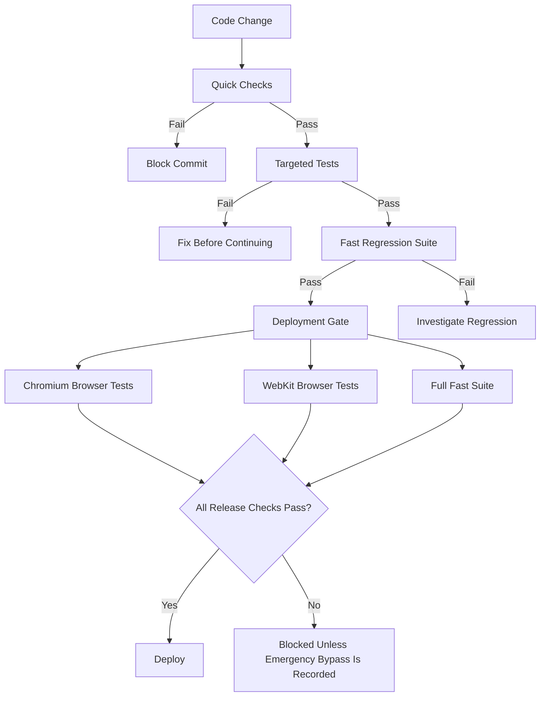
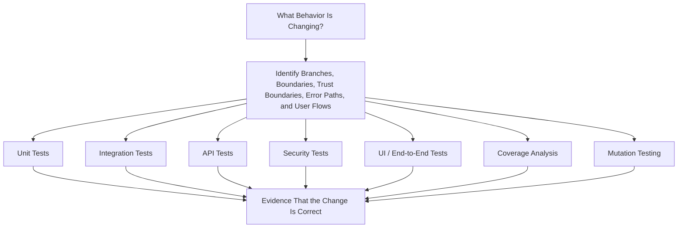

# From a Test Suite to a Testing Strategy

Media Tube began as a small automation project. At that scale, a few scripts and careful manual verification were a reasonable tradeoff. The project now has a browser application, background workers, a separate API, PostgreSQL state, object storage, internal services, authentication, AI-assisted workflows, and a growing set of user-facing features.

As the system has grown, the cost of being wrong has changed with it.

I already have a meaningful automated test suite and deployment gate. They catch real defects, including problems that would have been easy to ship because they existed in error paths, integration boundaries, or browser-specific behavior.

What I do not want to do is mistake a large collection of tests for a complete testing strategy.

My next step, after finishing the remaining web/API refactor, is to turn the current safeguards into a more deliberate engineering standard built around behavior, risk, boundaries, security, coverage, and a question ordinary test coverage cannot answer:

**Would these tests notice if the code were subtly wrong?**

The goal is not to maximize test count or chase a coverage badge. The goal is to improve confidence without creating so much process that the project becomes difficult to change.

## The starting point: Media Tube already has real testing discipline

Media Tube is not a project where `pytest` occasionally runs and that is considered sufficient testing.

The repository already has:

* a large Python test suite
* API tests
* focused regression tests
* browser tests
* linting
* security scanning
* SQL validation
* isolated test environments
* a deployment command that runs release-grade checks automatically

The workflow is intentionally graduated because the application is nontrivial and the host is shared with other workloads.

@@FIG testing-ladder.png | The graduated workflow: fast checks run constantly, and the expensive full suite runs only at the deployment gate.

### 1. Quick checks

These run before a commit and include:

* diff hygiene
* Python compilation
* JavaScript linting
* Python linting
* security scanning
* probable-secret detection

### 2. Targeted tests

Tests associated with the changed source paths run along with relevant schema and repository checks.

The goal is to get useful feedback close to the change without paying the cost of the entire test suite after every edit.

### 3. Fast regression suite

The broader suite can run while development continues.

This preserves broad regression coverage without creating a workflow slow enough that someone is eventually tempted to skip the tests entirely.

### 4. Deployment gate

Deployment runs the full fast suite along with browser tests in Chromium and WebKit.

A failed deployment gate blocks the release unless an explicit emergency bypass is recorded.

The overall flow looks like this:



The browser suite uses Playwright and runs against both Chromium and WebKit. That distinction matters because I use the application on an iPhone. A Chromium-only test pass does not prove that the same workflow functions correctly in Safari or another WebKit-based browser.

Failed browser tests retain screenshots and traces, so a failure produces evidence that can be inspected and replayed rather than only a failed assertion in a log.

The test suite also uses fakes where real external systems would make testing slow, costly, destructive, or nondeterministic.

Object-storage behavior, for example, is tested against an in-process HTTP fake rather than a real bucket.

At the same time, I do not want to mock the application so aggressively that the tests only validate my assumptions about the implementation. API tests still exercise real routing, serialization, validation, authentication wiring, and database behavior through the application boundary.

That distinction is important: the purpose of testing is to make it harder for the implementation to be wrong, not to make it easier for the test suite to turn green.

## What the current safeguards have already taught me

The best justification for testing is not the theory behind it. It is the defects the process catches before they become production problems.

### Error paths are production code

One linting pass found exception handlers that referenced `sys.stderr` without importing `sys`.

The missing import existed inside a branch that only executed after another failure had already occurred. Normal use had never exposed it, and Python syntax validation could not detect the runtime name lookup.

Static analysis could.

The same pass found unreachable code left behind by an earlier workflow and several places where exceptions were silently swallowed.

These were not dramatic bugs, but they are exactly the kind that turn a recoverable operational problem into confusing behavior that is difficult to diagnose.

That changed how I think about error handling. Error branches are not secondary code. They are part of the product and need meaningful testing around exception paths, retries, cleanup, transaction consistency, and user-visible failure behavior.

### Security tooling has to prove that it is actually scanning

Static analysis can fail in a particularly dangerous way: it can report a clean project because the scanner configuration no longer matches the intended files.

That creates more risk than a loud failure because it produces false confidence.

Media Tube's lint and security environment therefore contains deliberately broken Python and JavaScript fixtures.

Before scanning the real code:

* ESLint must reject intentionally invalid JavaScript
* Ruff must identify intentionally invalid Python
* Semgrep must match intentionally vulnerable patterns

If those checks unexpectedly pass, the validation environment itself fails.

The source tree is also mounted read-only inside the tooling container. A scanner that is supposed to inspect code should not be able to silently modify the repository while doing so.

This led to a broader rule for the testing strategy: the output of a verification tool is useful evidence only if I also have confidence that the tool actually performed the intended verification.

### Database correctness requires more than parameterized SQL

The repository contains a SQL gate that extracts reachable SQL from staged code and prepares those statements against the actual PostgreSQL schema without executing them.

That catches problems such as:

* invalid table names
* invalid column names
* SQL syntax errors
* incorrect statement structure
* invalid assumptions about parameters

The tool also reports dynamically assembled SQL that it cannot reliably inspect.

That distinction matters. A statement that could not be analyzed is not equivalent to a statement that was validated successfully.

The same principle applies when the database itself is unavailable. A missing dependency should not be represented as a passing test.

The planned strategy extends this into behavioral query-security testing, including:

* malformed filters
* invalid sort fields
* extreme pagination values
* injection-like input
* attempts to cross user boundaries

Parameterized queries are important, but they are not the entire definition of secure database behavior.

### Browser tests catch failures lower layers cannot represent

An API can return perfectly valid JSON while the browser application is still broken.

A release can contain:

* a missing JavaScript asset
* an uncaught browser exception
* a broken control
* a layout that is unusable at mobile widths
* a workflow that behaves differently in Safari
* a route that works at the API level but fails when exercised through the UI

Playwright tests the running application rather than isolated browser functions.

The browser suite also runs against an isolated test deployment with its own disposable database and no production network access. That isolation is just as important as the assertions themselves. A UI test should never accidentally become a test against live personal data.

The future standard will preserve this approach while making the requirement more explicit: material user-facing changes should include an end-to-end happy-path test, with additional persistence, validation, permission, destructive-action, and failure-path coverage when the risk justifies it.

## What I am not doing yet

The existing test program is substantial, but I do not want to describe planned work as though it is already implemented.

I am not currently enforcing universal repository-wide thresholds for:

* line coverage
* branch coverage
* changed-line coverage
* mutation score

I am also not yet using property-based testing as a standard approach for parsers, normalizers, and other broad-input code.

Mutation testing is not yet part of the normal workflow for every change to business logic, and security testing, while present in several areas, is not yet organized into a single independently runnable suite with a consistent decision framework for every trust boundary.

Those are sequencing decisions, not an argument against those techniques.

The project is still completing a significant architectural change: business and persistence logic is being moved out of the web/presentation layer and into the API.

Coverage measurement and mutation testing become considerably more useful once ownership boundaries are stable.

If I fully harden every intermediate architecture before moving to the next one, I spend time writing tests around boundaries I already intend to remove. That creates unnecessary churn and can make a project feel productive while actually slowing down the architectural work that will make future testing easier.

The current suite protects the application while the refactor continues. The stronger standard can then be applied to stable seams between unit logic, integration code, APIs, authorization boundaries, persistence, and the browser.

I do not view that as postponing quality. I view it as sequencing deeper investment where it will compound instead of being rewritten.

## Why functionality ships before the testing program is perfect

There is a real opportunity cost to every layer of engineering process, particularly in personal projects and small teams.

It is possible to spend months designing an extremely rigorous testing framework around an architecture that is still changing while the application itself remains unfinished.

I do not consider that a good tradeoff.

My approach is to establish enough protection to ship responsibly:

* automated regression tests
* static analysis
* browser coverage
* deployment gates
* backups
* isolated test environments
* explicit rollback paths

Then I can complete the architectural work that gives the next level of testing a stable place to live.

This does not mean tests are optional until some later phase. It means the testing strategy has its own roadmap:

1. protect existing behavior now with focused regression and integration testing;
2. keep the deployment gate meaningful;
3. finish API ownership boundaries;
4. add deeper measurement and defect-detection techniques to stable modules;
5. apply the stronger standard to new changes while improving existing code as it is touched.

That avoids both extremes: shipping recklessly on one side and spending so much time designing the perfect process that the product stops moving on the other.

## The future state: test behavior, not just executed lines

The future standard starts with a question before choosing a test framework:

**What externally observable behavior is changing?**

For each meaningful change, I want to identify:

* branches
* boundary conditions
* trust boundaries
* error paths
* affected user workflows

From there, the appropriate types of evidence can be selected.



Not every change needs every layer.

A small formatting change does not require mutation testing. A new authorization rule probably does.

The important point is that one test layer should not be skipped simply because another layer happened to execute the same lines of code.

For example, changing Favorite behavior may require:

* a unit test proving state transitions
* an API test proving validation and ownership
* an integration test proving the change persists
* a Playwright test proving the user can click Favorite and still see the state after reloading the page

Those tests overlap in code execution, but they answer different questions.

The behavior drives the required evidence rather than the available framework determining what gets tested.

## Coverage as a guardrail rather than a goal

The future target is:

* at least **90% total line coverage**
* at least **85% total branch coverage**
* at least **95% coverage of added or modified lines**

@@FIG quality-guardrails.png | The coverage and mutation thresholds I am building toward. They apply per change so new work is held to a standard even where legacy code is not.

@@FIG coverage-over-time.png | Real progress toward those targets: overall coverage went from 62% on Aug 21 to 79% on Aug 27 as business logic moved into the unit-testable API layer. Each point is a real coverage.py run.

Critical business rules should trend higher, particularly:

* authorization
* ownership
* security-sensitive logic
* destructive operations
* important transformations

Those numbers are not a substitute for meaningful assertions.

A test can call a function and assert that the return value is not `None`, increasing coverage while proving almost nothing.

The testing standard should favor exact, observable outcomes:

* expected values
* expected state changes
* exact response behavior
* persistent database effects
* expected denial behavior
* expected cleanup after failure

Branch coverage is particularly useful because line coverage can hide untested logic.

Consider an authorization condition allowing access when a caller is either an administrator **or** owns the resource.

It is possible to execute every line without proving:

* the owner path
* the administrator path
* non-owner denial
* anonymous denial
* unusual identifiers
* invalid ownership data

Meaningful branch combinations are what matter.

If historical code keeps overall repository coverage below the desired threshold, the solution should not be manipulating exclusions or weakening expectations for new work.

The rule should instead be:

* do not reduce existing coverage;
* improve the code being touched;
* meet the changed-code standard;
* report existing debt honestly.

## Mutation testing asks a different question

Coverage answers:

> Did the tests execute this code?

Mutation testing asks:

> Would the tests notice if this code were slightly wrong?

For changed business logic, I plan to run mutation testing against the affected modules.

A mutation tool might change:

```python
>=
```

to:

```python
>
```

Or it may:

* reverse a condition
* flip a boolean
* change an arithmetic operator
* remove part of a comparison

If the entire test suite still passes, the mutation has survived.

That is evidence that the tests did not sufficiently specify the behavior.

The planned target is at least an **80% mutation score for changed business logic**, with higher expectations for important rules and as close to complete as practical for authorization and security behavior.

The percentage itself is not the objective.

Every surviving mutation should be reviewed.

If the mutation changes real behavior, the test suite needs another assertion.

If it is genuinely equivalent behavior, that should be documented rather than creating a meaningless test solely to increase the score.

If the mutation exposes ambiguity in the requirement, then the product behavior should be clarified first.

Mutation testing is especially useful for the kinds of bugs that matter in a stateful application like Media Tube:

* boundary comparisons
* ownership checks
* filtering
* sorting
* validation
* deletion rules
* retries
* idempotency

## Security tests should follow trust boundaries

Security is not meaningfully represented as a percentage of source lines.

The important unit is the **trust boundary**.

For any operation, I care about questions such as:

* Who can call it?
* What input can they control?
* Which records can they access?
* What state can they modify?
* What external effects can they trigger?

Authentication tests should eventually cover scenarios such as:

* missing credentials
* malformed credentials
* invalid credentials
* expired credentials
* revoked credentials, where applicable
* successful authentication

Authorization tests need a separate set of scenarios:

* resource owner
* another authenticated user
* administrator
* anonymous caller
* modified resource identifiers
* direct API calls
* attempts to cross user boundaries

That is how I want to test for IDOR/BOLA-style problems rather than simply proving that the normal UI happens to submit the correct resource ID.

The same approach applies to user-controlled input.

Relevant inputs include:

* search filters
* sort fields
* pagination
* filenames
* uploaded files
* storage paths
* structured payloads
* Unicode
* extremely large values
* malformed encodings
* duplicate requests
* traversal-like paths

The test should prove correct and safe behavior, not merely that the application returned something other than HTTP 500.

State-changing operations also need tests for:

* duplicate requests
* replay behavior
* idempotency
* invalid state transitions
* ownership enforcement
* mass assignment
* CSRF where relevant

These concerns become increasingly important as the application gains more users, APIs, automation, and machine clients.

## Integration tests should use real boundaries where they matter

Mocks are useful when an actual dependency would make the test slow, expensive, destructive, or nondeterministic.

Examples include:

* external APIs
* cloud services
* time
* operating-system behavior
* expensive AI systems

Mocks become less useful when they replace the actual component whose integration behavior I am trying to validate.

The planned strategy therefore keeps real behavior where practical for:

* PostgreSQL
* routing
* serialization
* validation
* dependency wiring
* authentication middleware

API tests should verify more than status codes.

Where applicable, they should prove:

* the response shape
* persistent database state
* authorization behavior
* validation behavior
* not-found handling
* duplicate handling
* invalid state behavior
* dependency failures

Database tests should exercise the real query construction and ownership restrictions.

File operations should test things such as:

* storage-path containment
* traversal attempts
* MIME mismatches
* size limits
* replacement behavior
* unauthorized downloads

The existing disposable PostgreSQL environment, fake object storage, and isolated test application already provide a useful foundation for this style of testing.

## Property-based testing for broad input spaces

Handwritten test examples are important, especially for regressions and meaningful boundary cases.

They become less effective when the valid input space is extremely broad.

Examples include:

* parsers
* normalizers
* slug generation
* URL construction
* identifier handling
* character encodings
* date handling
* search syntax

For those areas, I plan to introduce Hypothesis where it provides value.

Property-based tests can generate a large number of inputs and verify invariants such as:

* generated slugs contain only allowed characters;
* parsers do not crash on arbitrary valid input;
* serialization followed by deserialization preserves meaning;
* generated identifiers satisfy required constraints.

Property-based tests would complement rather than replace regression tests.

A production bug still deserves a readable permanent test reproducing that specific failure. Generated inputs serve a different purpose: exploring combinations that nobody explicitly thought to write down.

## UI testing remains evidence-driven

Playwright is already a core part of Media Tube testing, and I expect it to remain that way.

The stronger testing standard does not mean reproducing every unit test in the browser.

It means identifying the important user flow associated with a material UI change and verifying that flow against the running application.

Depending on the risk, that may include:

* the primary happy path
* validation failures
* persistence across reloads
* authorization behavior
* destructive operations
* browser-specific behavior
* important error states

Failure artifacts are part of that evidence.

Screenshots and traces should be retained for failed runs, with video available where it adds diagnostic value.

Selected successful screenshots can also be useful checkpoints for important workflows, but they are not substitutes for assertions.

The eventual CI artifact set should include things such as:

* coverage reports
* JUnit output
* mutation reports
* security results
* Playwright reports
* screenshots
* traces
* browser videos where useful

The goal is for a failed run to be diagnosable by someone other than the person who wrote the change.

## Risk-based rigor instead of ritual

Not every piece of code deserves exactly the same testing investment.

Generated code and simple startup wiring do not need the same mutation-testing priority as an authorization rule or deletion workflow.

At the same time, "hard to test" should not become another name for "glue code."

If code makes decisions, transforms data, enforces access, routes requests, or controls failure behavior, then it contains behavior worth testing.

The planned expectations look roughly like this:

| Code category                    | Testing expectation                                                                                  |
| -------------------------------- | ---------------------------------------------------------------------------------------------------- |
| Core business logic              | Near-complete line coverage, high branch coverage, boundary and failure tests, strong mutation score |
| Authentication and authorization | Every meaningful allow and deny branch, prohibited-action tests, mutation testing                    |
| API/service layer                | Strong API contracts, validation, persistence verification, integration coverage                     |
| Persistence/repositories         | Real PostgreSQL behavior, constraints, transactions, query safety                                    |
| Parsers and normalizers          | Explicit examples plus property-based testing where appropriate                                      |
| UI workflows                     | Primary happy path plus risk-based validation, persistence, permission, and destructive-action tests |
| Wiring/generated code            | Lower priority unless it contains actual decision or failure behavior                                 |

Every bug fix should also begin with a test reproducing the defect when practical.

That test should remain after the fix.

A bug that reached development or production is information about a case the existing testing strategy failed to represent. Keeping the regression test turns that lesson into part of the system.

## What "done" should mean

In the future state, `pytest` returning zero should not by itself define completion.

For a meaningful feature, fix, refactor, or deletion, I want the resulting work to be able to state:

* what behavior changed;
* which unit and integration tests were added;
* which important boundaries and edge cases were exercised;
* which API, authorization, and security scenarios were covered;
* which UI workflow was tested, when applicable;
* the resulting line and branch coverage;
* mutation results for changed business logic;
* surviving mutations and their disposition;
* intentionally uncovered behavior and its justification.

That information makes testing decisions reviewable.

It also prevents testing from becoming ceremony where a collection of tools runs successfully but nobody can explain what risks those tools actually examined.

## The actual objective

The goal is not 90% coverage.

It is not an 80% mutation score.

It is not a CI dashboard containing as many green checks as possible.

The goal is to make Media Tube safer to change.

As the system grows, one modification can affect:

* a browser workflow
* a background worker
* an API contract
* a PostgreSQL record
* an object in storage
* search behavior
* authentication
* an authorization boundary

A mature testing strategy gives each of those risks an appropriate way to be challenged.

It should catch regressions early, make refactoring less risky, document behavior more precisely than prose alone, and turn previous defects into permanent protection against repeating the same mistake.

I am deliberately finishing the remaining web/API refactor before implementing every part of this program because I want the investment to land on stable architecture rather than repeatedly hardening intermediate designs.

In the meantime, the existing gates continue to protect real functionality and make responsible shipping possible.

The balance I am aiming for is straightforward: rigorous enough that I can trust what I ship, practical enough that I can continue building, and honest enough to distinguish **"the tests executed"** from **"the system was meaningfully challenged."**