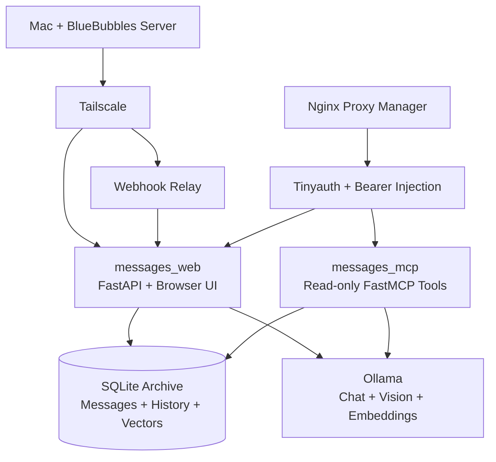
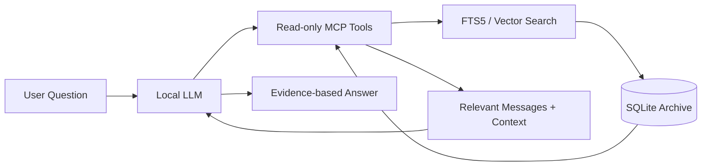
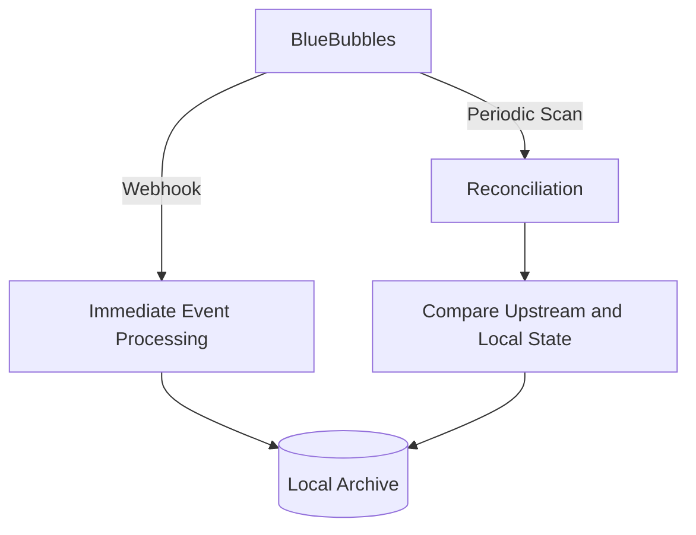

# Building a Private, AI-Native Messages Archive

Most messaging software is built around the present: show the latest message, synchronize it, and move on.

I wanted to solve a different problem.

What would messaging software look like if personal conversations were treated as a historical record rather than only as current state?

That idea became Messages Archive, a private, self-hosted web application with an Apple Messages-inspired interface and a durable archive underneath it.

The application reads from a BlueBubbles server connected to a Mac, stores observed message state locally, preserves earlier message revisions when possible, and adds a local AI layer for natural-language retrieval.

The project combines several areas I enjoy working on: product-quality UI, imperfect external APIs, privacy-sensitive data, asynchronous processing, data modeling, tool-using LLMs, and running local AI on constrained hardware.

@@FIG running.png | Messages Archive running: the conversation list beside the local AI assistant, which is working through a question across several tool-call rounds: resolving contacts, checking the time, and pulling messages in range.

## The product: an archive, not just another chat client

At first glance, the application looks similar to Messages. It has a conversation list, contact photos, blue and gray message bubbles, reactions, replies, attachments, delivery and read state, mobile layouts, dark mode, and a compose interface.

@@FIG model-panel.png | Messages AI is configurable: the model panel selects the chat/vision and embedding models the assistant uses, each shown with its capabilities and memory footprint.

The more important behavior is underneath the UI.

When the application observes a message, it stores both the current message and information about what was observed.

If that message is edited later, the previous revision remains available.

Attachments, chat metadata, reactions, delivery and read timestamps, typing activity, and other observable state are designed around the same principle.

A conventional messaging client mostly asks:

> What is the current value?

An archive has to ask different questions:

> What did I observe? When did I observe it? What changed afterward?

That distinction affects nearly every part of the system.

There is also an important limitation that I wanted to make explicit from the beginning: the archive can only preserve information after it has observed it.

If activity happens before BlueBubbles or Messages Archive sees it, the archive may never receive enough information to capture it.

Rather than claiming completeness the system cannot guarantee, I treat that as a known boundary. A future Mac-side capture component would provide a stronger solution for that gap.

## Architecture

BlueBubbles acts as the integration boundary to Apple Messages.

It runs alongside the Mac's Messages data and exposes APIs for chats, messages, attachments, webhooks, and, when enabled, additional private API functionality.

Messages Archive does not try to reimplement Apple's messaging stack. Instead, it consumes BlueBubbles as an upstream system, validates the expected server version, and converts the data it observes into a durable local archive.

The deployment looks roughly like this:

The system is deployed through Docker Compose so the entire stack can be started consistently, while persistent data remains on bind mounts.

Those mounts separate:

* the SQLite database
* message attachments
* avatars
* thumbnails
* backups
* Ollama model data

Keeping those concerns separate makes backup simpler and also makes a future move to NAS-backed storage possible without changing application logic.

### `messages_web`

`messages_web` is the main application.

It is a Python/FastAPI service responsible for:

* the browser UI
* archive synchronization
* the application event stream
* attachment delivery
* the AI request queue
* the local application API

It is also the only container allowed to write to the archive database.

That restriction is deliberate. Personal messages are the most sensitive data in the system, so I want the number of components with write access to be as small as possible.

### `messages_mcp`

`messages_mcp` runs separately as a read-only FastMCP service over the same archive.

It exposes narrowly scoped tools for operations such as:

* resolving contact names
* listing contacts
* searching messages
* retrieving surrounding conversation context
* inspecting conversations
* checking embedding coverage

Separating MCP from the application server reduces the blast radius of that integration.

An MCP framework upgrade, an experimental client, or an externally connected AI system should not automatically receive write access to the archive simply because it can search it.

### `ollama`

Ollama provides the local model runtime and is only reachable internally.

The browser never talks directly to Ollama. Model access stays behind application-controlled interfaces where requests can be authenticated, queued, logged, and constrained.

### `tailscale` and the webhook relay

Tailscale provides the network abstraction between the archive host and the Mac running BlueBubbles.

The application can refer to the Mac through the tailnet instead of embedding a specific LAN address or assuming that the machines will always remain on the same physical network.

A small webhook relay receives BlueBubbles events over the Tailscale path, injects the application's required bearer credential, and forwards the request to Messages Archive.

### Networks and public exposure

The Compose deployment uses separate networks rather than connecting every service to everything else.

The internal network is reserved for backend communication. A limited external network is shared only with Nginx Proxy Manager for services that need to be reachable through the reverse proxy.

Application containers do not publish their own host ports.

Nginx Proxy Manager terminates HTTPS and routes the public hostname to `messages_web`.

Tinyauth provides the interactive browser login, and Nginx additionally injects an application bearer token into proxied requests.

That extra bearer check is intentional defense in depth. Reaching the hostname should not, by itself, be enough to call the application's internal API.

The MCP endpoint uses a separate bearer token because it exposes a different capability with a different risk profile.

## Designing the archive around evidence

SQLite was a good fit for this project.

Messages Archive is a single-user, self-hosted application with one primary writer, a strong requirement for simple backups, and a need to keep relational records, full-text search, and vector metadata close together.

PostgreSQL could handle the workload, but at the current scale it would introduce additional operational complexity without solving a problem I actually have.

The schema contains current-state tables for data such as:

* chats
* messages
* attachments

It also contains append-only history for:

* message versions
* chat versions
* attachment versions
* raw archive events
* AI conversation events

SQLite FTS5 provides lexical search.

That combination allows the UI to show the latest known state while still preserving enough history to answer questions about how that state changed.

This also changes how older message revisions should be treated by AI retrieval.

An embedding generated from a previous message revision is not equivalent to a current statement.

Searchable documents therefore carry provenance such as:

* current message
* historical revision

The model is instructed to qualify that evidence instead of presenting an outdated revision as current truth.

## Adding AI without turning the archive into a black box

The AI goal was never just to put a chat interface in front of a message database.

I wanted natural-language retrieval that still preserves evidence and context.

A question like:

> When did Melissa mention an appointment?

should result in the system finding relevant messages, retrieving the surrounding conversation, and producing an answer based on the actual archive rather than asking the model to guess from a large prompt.

I built that around three layers.

### 1. Embeddings and lexical search

Text is embedded using `nomic-embed-text:v1.5`, while SQLite FTS5 remains available for lexical retrieval.

The initial embedding strategy prioritizes the recent parts of the archive that are most likely to be useful.

It begins with the newest 30 days of messages from chats that were active within the previous 60 days, then gradually works backward through older history.

That gives useful semantic coverage relatively quickly rather than spending the first several hours processing years of conversations that may rarely be searched.

### 2. Tool use

The chat model does not receive the entire message archive in its prompt.

Instead, it can call read-only FastMCP tools to:

* resolve people
* search relevant conversations
* retrieve surrounding messages
* inspect archive coverage
* gather enough evidence to answer the request

This keeps context bounded and allows the application to control exactly what the model can retrieve.

The basic flow looks like this:

### 3. Visible model activity

I also wanted the AI system to be observable.

The UI records things such as:

* request queueing
* model loading
* archive tool calls
* reasoning rounds
* answer generation
* errors
* timings
* the system prompt used for the request

That makes it possible to understand why a local AI request was slow, which tools were used, and where a failure occurred.

Local AI becomes much easier to debug when it is treated like another distributed system instead of an opaque text box.

@@FIG ai-tool-call.png | A question answered end to end: the assistant reasons, calls a read-only archive tool to search messages, works from the returned result, and produces the answer, with every step visible in the activity panel.

## Why SQLite Vec1 instead of a separate vector database

I chose the SQLite Vec1 extension because the vectors belong to records that are already stored in SQLite.

Keeping them together avoids adding:

* another service
* another authentication boundary
* another backup process
* another synchronization mechanism
* another consistency problem

The vector design is also deliberately versioned by model provenance.

Each embedding model is identified using information such as:

* provider
* exact model name
* model digest
* modality
* dimensions

Each model gets its own independent vector index.

Changing the configured embedding model does not overwrite the vectors generated by the previous model. It creates a new index.

That means I can test a new embedding model, compare results, switch back if necessary, and avoid throwing away previously generated data.

I have come to think of embedding-model changes as data migrations.

Vectors may be derived data, but once enough time and CPU have been spent generating them, treating them as anonymous disposable blobs makes reproducibility, rollback, and debugging unnecessarily difficult.

## Model selection under hardware constraints

Messages Archive runs on a compact Dell Micro-class system with about 32 GB of RAM, integrated graphics, and no discrete GPU.

That turns model selection into a systems problem rather than a benchmark comparison.

A larger tool-capable model may produce better answers, but it also competes with the rest of the application for memory and CPU.

Loading a large chat model alongside an embedding model and a separate vision model can easily lead to:

* swap pressure
* high CPU utilization
* long request latency
* an unresponsive browser experience

I tested larger tool-capable models such as Qwen 3 8B alongside smaller options such as Gemma-class models.

The current configuration uses `gemma4:e4b-it-qat` for chat, tool orchestration, and image understanding, with Nomic handling text embeddings.

The quantized model is a practical compromise: capable enough to use tools effectively, small enough to operate on the available hardware, and flexible enough to reduce the number of concurrently resident models.

@@FIG model-panel.png | The in-app model panel: a tool-capable chat/vision model, a smaller fallback, and an always-loaded embedding model, each labeled with its capabilities and memory footprint.

The system also limits model residency and concurrent work.

Ollama serializes inference, keeps models resident for a limited idle period, and restricts the number of simultaneously loaded models.

Background embedding yields when an interactive AI request is active.

Interactive questions enter an asynchronous queue rather than holding a normal HTTP request open while waiting for CPU-bound model work.

The goal is not maximum throughput. It is predictable degradation.

If the system is busy, I would rather show that work is queued than allow local AI to make the rest of the application appear frozen.

An external OpenAI-compatible endpoint is configurable as well.

That keeps the application and MCP interfaces stable if inference later moves to a different machine, such as a Windows host with an NVIDIA GPU.

## Problems that improved the design

A significant amount of the architecture came from encountering failure modes and then designing so the same category of failure would be less likely to happen again.

### External API compatibility

BlueBubbles behavior depends on its version and on which private API capabilities are enabled.

Allowing the system to continue under partial compatibility would be particularly dangerous for an archive because incomplete synchronization can look like successful synchronization.

The application therefore performs explicit version validation, emits loud diagnostic logs, fails health checks when necessary, and presents a prominent error in the UI.

"It mostly synced" is not an acceptable state for archival software.

### Webhooks are not the source of truth

Webhooks are useful because they are fast, but they should not be treated as perfectly reliable.

Messages Archive combines low-latency webhook processing with periodic reconciliation scans.

This is a pattern I would use for many event-driven integrations.

Events provide responsiveness. Reconciliation provides correctness.

### Attachments should not freeze the interface

Early attachment sending made the browser appear frozen because the request stayed open while upstream delivery completed.

I moved outgoing attachment work into a persistent queue.

The UI now receives an immediate queued state, while processing continues asynchronously.

If the process is interrupted, the item can become a visible "needs attention" state rather than being blindly replayed and potentially sending a duplicate message.

### Restarting should not mean losing work

AI requests, responses, model activity, and failures are persisted in SQLite instead of relying entirely on browser state.

The database is also backed up before creating vector indexes.

These are relatively inexpensive controls, but they make experimentation and operational mistakes much easier to recover from.

### Local AI can starve the application

Running several models on CPU-only hardware made one thing clear very quickly: background AI is not useful if it makes the primary application unusable.

The combination of:

* limited model residency
* serialized inference
* asynchronous queueing
* interactive priority
* background-worker yielding

helped more than simply choosing the smallest possible model.

The real problem was resource scheduling, not just model size.

## What I learned

The interesting part of Messages Archive is not that it uses Docker, SQLite, FastAPI, Ollama, BlueBubbles, or MCP.

Those are implementation choices.

What matters more is why each one is there.

Privacy requires local ownership of data and a small exposure surface.

Historical fidelity requires storing observations and revisions instead of only the latest state.

AI reliability requires provenance, bounded retrieval tools, and visible failure states.

Running on modest hardware requires queueing, model residency limits, and deliberate resource scheduling.

A personal project still benefits from the same operational habits I would want in a production system:

* health checks
* backups
* least privilege
* version validation
* idempotent operations
* durable queues
* explicit failure states
* observable background work

Messages Archive is still evolving.

The next major areas I want to improve include fuller attachment backfill once the necessary upstream API support is enabled, better PWA support, and richer semantic retrieval across images and longer historical periods.

The foundation is already the part I care about most: private data stays under my control, AI activity is inspectable rather than opaque, and the system is designed so that when something goes wrong I can understand what happened.

That is the kind of software I want to keep building: useful at the surface, deliberate underneath, and engineered so that its behavior remains understandable as the system grows.