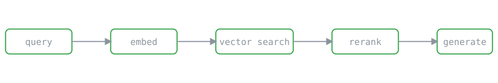

Retrieval-augmented generation demos beautifully. You wire an embedding model to
a vector store, stuff the top-k chunks into a prompt, and the model answers
questions about your data. Then you point real traffic at it and every one of
those simplifications turns into an incident.

Here's what actually broke, in the order it broke.



## Chunking is a product decision, not a preprocessing step

The first version split documents every 512 tokens on whitespace. It retrieved
*fragments* of the right answer — a sentence that started an explanation, but not
the sentence that finished it. Recall looked fine in offline eval and felt broken
to users.

What fixed it:

- Split on **semantic boundaries** (headings, list items) before falling back to
  a token budget.
- Keep a small **overlap** so a chunk carries enough context to stand alone.
- Store the parent-document reference so I can expand context at answer time.

```python
def chunk(doc: Document, max_tokens: int = 512, overlap: int = 64) -> list[Chunk]:
    chunks, buf = [], []
    for block in doc.semantic_blocks():          # headings, paragraphs, list items
        buf.append(block)
        if token_count(buf) >= max_tokens:
            chunks.append(Chunk(buf, parent=doc.id))
            buf = buf[-overlap:]                  # carry a little context forward
    if buf:
        chunks.append(Chunk(buf, parent=doc.id))
    return chunks
```

## The retriever's job is precision; the reranker's job is order

Top-k cosine similarity gets you *candidates*. It does not get you the right
*order*, and order is what the model actually pays attention to. Adding a
cross-encoder reranker over the top 20 candidates — then passing the top 5 to the
model — did more for answer quality than any prompt change I tried.

> Measure retrieval and generation separately. If you only look at the final
> answer, you can't tell whether the model reasoned badly or never saw the
> evidence.

## Latency is a budget you spend, not a number you hope for

Embedding, vector search, rerank, and generation each cost time. Under load, the
p95 mattered far more than the average. The fix was boring and effective: cache
embeddings for repeated queries, run retrieval and reranking with a hard timeout,
and degrade gracefully to a smaller candidate set instead of failing the request.

None of this is glamorous. All of it is the difference between a demo and a
system.
