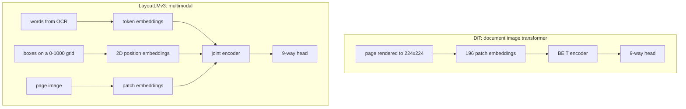
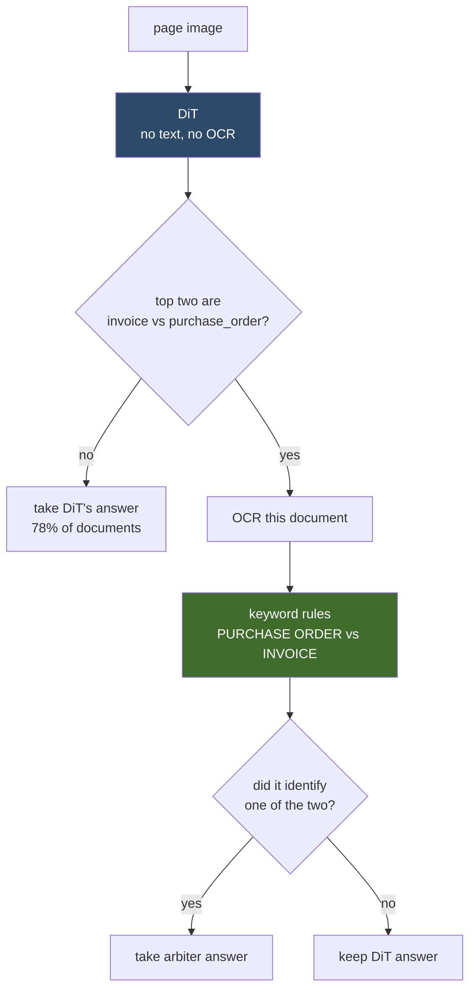
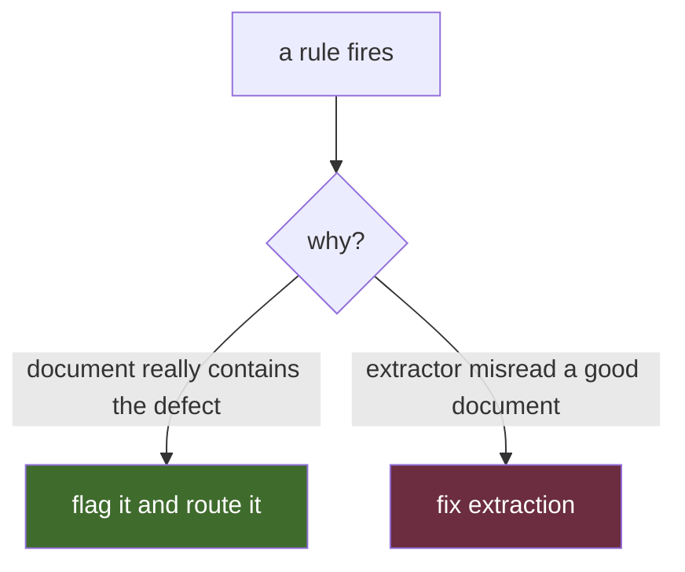
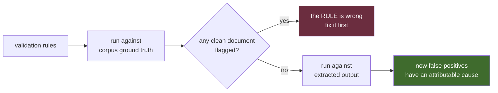

Two phases ago, the system could extract fields from a document, but it still had two pretty important advantages that a real production pipeline would never get.

It already knew what kind of document it was looking at, because the corpus handed it the answer. It also had no good way to tell me when the extracted result was wrong.

Phases 3 and 4 were about removing both of those shortcuts.

Phase 3 added classification and document splitting. Phase 4 added validation. On paper, neither one sounded particularly difficult. Classification is a solved problem, and validation is mostly rules.

That turned out to be a very incomplete description of both.

Along the way, a vision model appeared to beat every model that could actually read the document. A machine learning splitter lost to about nine lines of code. A validator that scored **0.918 recall** against ground truth dropped to **0.564** when I put real extracted data underneath it.

Those numbers sound like failures. They were actually some of the most useful results in the project because each one showed me something I would have completely missed if I had only measured the part of the system I expected to work.

---

## Where the pipeline was

The architecture is still the same plugin pipeline I started with. Every stage sits behind a slot that can be swapped by changing the manifest:


Phases 0 through 2 built most of the right side of that chain. At that point I had a synthetic corpus with ground truth, a scoring harness with baselines, an extractor that turned documents into schema-constrained fields, and OCR for image-based documents.

Phase 3 filled in the splitter and classifier. Phase 4 added validation.

I have been deliberately ordering the project so that each phase removes one assumption that could make the whole thing look better than it really is. I also want every phase to end in a measurement rather than a demo.

If I cannot put a number on what improved, what broke, or what risk was removed, I do not really consider the phase finished.

---

## Phase 3: figuring out what the document actually is

### Classification looked solved almost immediately

"Classify the document" sounds like one of the easier problems in document intelligence.

I had five document types and a few hundred examples. Unsurprisingly, an LLM reading the extracted text scored **0.990** on clean documents.

That looked great.

It was also hiding two completely different problems.

The first problem was that the document type was not actually the answer the next stage needed.

The extractor needs a **schema**.

One of the document types in the corpus is `form`, but `form` contains five different variants:

| variant    | fields requested by the extractor |
| ---------- | --------------------------------: |
| onboarding |                                22 |
| loan       |                                19 |
| claim      |                                13 |
| w4         |                                 9 |
| w9         |                                 9 |

If the classifier tells me only that something is a `form`, I still do not know which schema to send to the extractor.

That is not a minor distinction. Forms make up about 45% of the corpus.

My classifier was scoring 1.000 on forms while the code that actually chose between `form:w9`, `form:claim`, `form:onboarding`, and the others was still reading the answer directly from the corpus.

In other words, the classifier was being credited for answering a question it was not really answering.

I changed the label space so it comes directly from the type registry. There are now **nine classification labels instead of five**:

```text
form:w9
form:w4
form:onboarding
form:loan
form:claim
invoice
purchase_order
resume
multi_bill_invoice
```

The important part is that those labels are generated from the same registry the extractor uses.

I did not want one hard-coded list inside the classifier and another hard-coded list inside the extractor. That is the kind of duplication that eventually produces two parts of the pipeline with different ideas about what a valid document type is.

Now the classification answer is also the schema-selection answer.

That fixed the first lie.

The second one was much bigger.

The same text classifier that scored **0.990 on clean documents scored 0.571 on faxes.**

---

### The fax problem was upstream of the classifier

The corpus generates each source document at four fidelity levels:

* clean digital document
* light office scan
* phone photograph with perspective distortion
* 170 dpi bitonal fax

@@FIG 02-four-profiles.png | The same invoice at four fidelity levels: clean digital, light office scan, phone photograph with perspective distortion, and a 170 dpi bitonal fax.

The classifier lost 42 points between clean documents and faxes.

The obvious response would be to try another model.

That is exactly the kind of thing I am trying not to do in this project until I understand what actually failed.

So I looked upstream.

On the fax corpus, **docTR finds only about 62% of the words**.

That distinction matters. It is not reading 38% of the words incorrectly. It never detects them at all.

Once the OCR stage fails to produce a word, the classifier has nothing to reason about. A better language model cannot recover text that never reached it.

That made me wonder whether the text was disappearing faster than the document structure itself.

A fax can destroy characters without necessarily destroying the shape of the page.

So before training anything, I tested that directly.

I took the OCR word boxes, threw the actual words away, converted only their positions into a coarse occupancy grid, and compared those layouts against the clean corpus.

No language model. No document model. No text.

Just where ink appeared on the page.

| profile | word retention | layout fidelity | type accuracy using position only |
| ------- | -------------: | --------------: | --------------------------------: |
| light   |          0.954 |           0.983 |                             1.000 |
| photo   |          0.938 |           0.958 |                             0.997 |
| fax     |          0.645 |           0.772 |                         **0.875** |

That was the experiment that changed the direction of the classifier.

On a fax, only about two thirds of the words survive OCR, but roughly three quarters of the page structure survives.

More importantly, **the positions of the detected words alone identify the document type more accurately than the LLM reading their text.**

@@FIG 03-fax-word-boxes.png | A fax page with docTR word boxes drawn on it. The text is visibly degraded, but the page's layout still looks structured — enough to identify the document type from position alone.

That experiment took maybe half an hour.

It also gave me a much better reason to try a layout or vision model than "document models seem like they should work."

I now had evidence that the signal those models use was actually surviving the degradation.

---

### DiT and LayoutLMv3 are solving different problems

I ended up testing two document models, DiT and LayoutLMv3.

They sound similar if you describe both of them as document classifiers, but the information they receive is very different.



**DiT** only sees the page image.

It is a vision transformer pretrained on millions of document images. The model gets pixels and does not know what any of the words actually say.

**LayoutLMv3** gets three signals:

1. OCR tokens
2. the bounding box for each token
3. image patches from the page

It learns how those signals relate inside the model.

That is meaningfully different from training a text model and an image model separately and averaging their probabilities afterward. LayoutLMv3 gets to learn interactions between the text, position, and image representations.

There are also a couple of implementation details here that are easy to get wrong while still producing code that runs.

The word boxes need to be normalized onto the expected 0 to 1000 coordinate grid. They cannot just be raw PDF coordinates.

The page dimensions used to normalize those boxes need to come from the same PDF page that produced the words.

And if I am giving the model the image from page one, I need to give it the words from page one too.

That sounds obvious, but a pipeline can very easily end up pairing the wrong page image and OCR result if those pieces are assembled independently.

I ended up creating the image, words, and normalized boxes together in one place specifically to remove that class of bug.

I also found a rasterization problem.

Originally I rendered document pages directly to 224 by 224 because that is what the vision model consumes.

That worked badly on faxes.

A 170 dpi bitonal fax contains very thin lines and character strokes. Point sampling it directly down to 224 pixels can make those features disappear depending on where the resampling grid lands.

The page can actually look cleaner after resizing because the lines that made it a document vanished.

The fix was to render much larger first, then downsample. Rendering at 4x resolution and shrinking afterward lets those fine black strokes contribute gray information to the final image instead of simply disappearing.

That little detail turned out to matter quite a bit.

---

### Then DiT scored 1.000

My first document-level holdout produced a result that looked incredible.

On faxes, **DiT scored 1.000**.

LayoutLMv3 scored 0.958.

So the model that could not read a single word appeared to beat the model that had the page image, the word locations, and the text.

I wrote up the result.

Then I realized the evaluation was wrong.

Not mathematically wrong. The score really was 1.000.

The holdout was wrong.

That distinction ended up being one of the bigger lessons in this project.

**A perfect score on generated data should make you suspicious.**

The synthetic corpus did contain different documents, but each document type was being generated from only a small number of visual templates.

At the time, invoices had three designs. Purchase orders had two.

If I randomly hold out documents, the test set contains new invoices but not necessarily new invoice *designs*.

A vision model does not need to learn the concept of an invoice if it can memorize the three ways my generator draws an invoice.

That is not generalization. It just produces the same score.

So I made the corpus harder.

Invoices, purchase orders, and multi-bill invoices now each have **ten structurally different page designs**.

Not ten color variations.

Actual structural differences.

Some look like formal centered invoices. Some look like old typewriter statements. Some use zebra tables. Some use bordered panels. One has a large dark sidebar. Another puts the amount due in a big hero section. Others have remittance coupons.

@@FIG 01-ten-invoice-designs.png | Ten structurally different invoice designs, not ten color variations. Holding out an entire design forces the model to learn the concept instead of memorizing templates.

Then instead of holding out source documents, I held out an entire **page design**.

The result changed dramatically.

| held out by     |   overall |       fax | purchase orders |
| --------------- | --------: | --------: | --------------: |
| source document |     0.958 |     0.917 |           0.938 |
| **page design** | **0.792** | **0.694** |       **0.125** |

Fourteen of sixteen purchase orders became invoices.

That result finally made sense.

Invoices and purchase orders are structurally very similar. They both tend to contain:

* a header
* vendor information
* a line-item table
* quantities and prices
* totals

The thing that often distinguishes them is not geometry.

It is the text at the top that says **INVOICE** or **PURCHASE ORDER**.

@@FIG 04-invoice-vs-po.png | An invoice and a purchase order side by side. They are structurally near-identical; the reliable difference is the title text at the top, not the geometry.

With two or three templates per class, the model could memorize the layouts and use that memorization as a substitute for understanding the class.

Once I gave it ten different designs and withheld one completely, that shortcut stopped working.

So my original conclusion was backward.

The image-only model did not prove that text was unnecessary.

It proved that my corpus did not contain enough visual diversity to force the model to use text.

That is a very different conclusion.

---

### The final classifier is a cascade

Once I knew exactly where DiT failed, the architecture became much simpler.

DiT is very good at almost everything in the corpus.

Its major weakness is the invoice versus purchase-order boundary.

Text handles that distinction extremely well.

So instead of forcing every document through an expensive multimodal pipeline, I made the classifier a cascade.



The order matters.

DiT can classify a page directly from the rendered image. It does not require OCR.

OCR is one of the expensive parts of the pipeline, especially across large degraded document sets.

So the fast path is:

**look at the image first.**

If DiT is deciding between something like `resume` and `form:w9`, I trust it.

If its top two candidates are `invoice` and `purchase_order`, I run OCR and ask a much narrower question.

Does the document actually say something like `PURCHASE ORDER` or `INVOICE`?

That tiny arbiter is not a good general-purpose classifier.

Its overall accuracy is only **0.700**, and it performs terribly on some classes.

That does not matter.

I am not asking it to classify the world.

I am asking it to break one tie that the primary model is known to struggle with.

On the unseen-design evaluation:

|                                      | DiT alone |   cascade |
| ------------------------------------ | --------: | --------: |
| purchase_order classified as invoice |         4 |     **0** |
| invoice classified as purchase_order |         2 |     **0** |
| **overall accuracy**                 | **0.778** | **0.944** |

That is probably one of my favorite results in this phase.

A mediocre classifier became a very good component once I gave it a narrow enough job.

**A weak classifier can be a strong arbiter.**

---

### I almost made the cascade more expensive for no benefit

Initially I assumed the escalation logic would need two triggers.

The first was obvious:

> If the top two classes are invoice and purchase order, use the text arbiter.

The second was going to be a confidence threshold:

> If DiT confidence is below 0.90, escalate anyway.

That sounds reasonable.

The measurement said not to do it.

Using only the invoice versus purchase-order pair trigger:

* accuracy: **0.944**
* documents escalated: **22%**

Adding a 0.90 confidence floor:

* accuracy: **0.944**
* documents escalated: **56%**

Exactly the same accuracy.

More than twice the OCR.

Every additional document I escalated was already going to be classified correctly by DiT.

So there is no confidence floor.

The right threshold was zero because the measurement gave me no reason to add one.

That is a recurring theme in this project. Quite a few ideas that sound like sensible robustness improvements become unnecessary complexity once you actually measure what they buy you.

---

### The arbiter also needed limits

The first implementation of the cascade had another bug.

The keyword classifier does not understand form variants. It can recognize something as `form`, but it cannot distinguish `form:w9` from `form:onboarding`.

Originally, if the arbiter returned `form`, I allowed it to overwrite DiT's answer.

That meant a correct `form:w9` classification could become plain `form`.

Now the extractor no longer knows whether it should request 9 fields or 22.

So the cascade actually became worse than DiT by itself.

The fix was to make the arbiter's authority extremely narrow.

It can only decide between **invoice** and **purchase_order**, and only when those are already the two classes DiT is considering.

Anything else gets ignored.

That rule exists because I broke it first.

---

## Splitting documents: when the dumb baseline wins

Classification solved one assumption, but there was another one hiding earlier in the pipeline.

Real scanning workflows do not always give you one document per PDF.

Someone can scan an invoice, a W-9, two purchase orders, and another invoice as one batch.

So I extended the corpus generator to create bundled PDFs from multiple source documents and record the true starting page for each document.

I also deliberately made half of the joins occur between two documents of the **same type**.

That is important because it creates the exact case a "split when the class changes" algorithm cannot see.

I tested three splitters:

| splitter                                             |        F1 | files exactly right | merged | over-cut |
| ---------------------------------------------------- | --------: | ------------------: | -----: | -------: |
| `single`: assume whole file is one document          |       n/a |               0.108 |    213 |        0 |
| **`every_page`: every page starts a document**       | **0.938** |           **0.783** |  **0** |       28 |
| `by_type`: classify each page and cut on type change |     0.772 |               0.458 |     62 |       27 |

The clever one lost.

Badly.

About 92% of the documents in this corpus are one page.

That means splitting every page is an extremely strong baseline.

It makes 28 unnecessary cuts.

The classifier-driven splitter misses 62 joins because the document on both sides of the boundary has the same type.

Its recall on exactly the case it was expected to struggle with is only **0.487**.

So for this corpus, the best splitter is basically:

```text
for each page:
    start a document
```

Sometimes nine lines of code are better than a model.

That is exactly why I keep the dumb baselines in the harness.

---

### Over-splitting was not as safe as I thought

I had also written down an assumption about splitter failures before testing the whole pipeline.

I expected an over-split to be relatively cheap.

If I cut a two-page document into two pieces, I assumed the second half would just be missing fields and therefore obviously incomplete.

Then I connected the splitter to the classifier and extractor.

That assumption died immediately.

@@FIG 05-multibill-cut-in-half.png | A two-page multi-bill invoice cut in half. Page two still has a vendor header, a line-item table, and totals — so it gets classified as an ordinary invoice, and the extractor confidently fills the wrong schema.

A multi-bill invoice can contain repeated service sections spread across pages.

If I cut it in half, page two may still contain:

* a vendor header
* a line-item table
* amounts
* totals

What it might no longer contain is the repeated structure from page one that tells the classifier this is a **multi-bill invoice** instead of an ordinary invoice.

So the classifier chooses the wrong schema.

Then the extractor confidently fills it.

That is not a missing-data failure.

It can produce believable wrong data.

I had originally thought merges were dangerous because they combine unrelated documents while over-cuts were mostly annoying.

The end-to-end test showed that both directions can fabricate a convincing result.

That is exactly the kind of mistake you do not find by testing the splitter only against boundary F1.

---

### What classification actually cost the extractor

The real deliverable for Phase 3 was not classifier accuracy.

It was this question:

**What happens to extraction when I stop giving the extractor the answer key?**

So I reran extraction across the same 175 documents, using the same extractor, same prompts, and same scoring harness.

The only thing I changed was where the document type came from.

| type source             | field accuracy | exact match |
| ----------------------- | -------------: | ----------: |
| corpus ground truth     |          0.959 |       0.809 |
| **pipeline classifier** |      **0.957** |   **0.809** |

The cost was **0.002** across 1,904 graded fields.

On those documents, the classifier selected the correct type and variant every time, so the extractor effectively received the same schema either way.

That is the good news.

The important caveat is that these are designs the classifier has already seen during training.

If I want to talk about what happens on a new vendor template, the number I should quote is the page-design holdout accuracy of **0.944**.

Quoting the 0.957 extraction score as proof of classification generalization would be technically true about the test and misleading about the thing I actually care about.

I am trying very hard not to do that.

---

## Phase 4: figuring out when the pipeline is wrong

Once the pipeline could decide what it was looking at, the next problem was deciding whether the extracted result made sense.

That is the validator's job.

Some examples are straightforward:

* line items should add up to the subtotal
* an SSN should contain nine digits
* an employment end date should not precede the start date
* required identifying fields should exist
* service periods should be internally consistent

The synthetic corpus contains **352 documents with 527 injected defects across 38 defect classes**.

That gave me ground truth for testing the validator.

But there is an important problem with validating an extraction pipeline.

The validator does not run against the original document.

It runs against **what the extractor thinks the document said**.

That means every time a validation rule fires, there are two possible explanations.



Those outcomes look identical from the validator's perspective.

The arithmetic does not balance either way.

But operationally they mean completely different things.

One means:

> This document has a problem.

The other means:

> My pipeline has a problem.

If I score the validator only against extracted output, I mix those two things together.

So I made validation a two-stage evaluation.

---

### The validator has to pass its own test first

Every rule is evaluated twice.

The first run uses **ground-truth fields directly from the corpus**.

No OCR.

No extraction.

No model mistakes.

Just the validator and known-correct structured data.



If a rule flags clean ground truth, I do not care how well it performs downstream.

The rule is wrong.

There is no extractor available to blame.

That makes the first evaluation a **gate**, not just another metric.

Only after the validator passes against ground truth do I run the same rules against real extracted output.

I used the same idea earlier in the project with the scoring harness. The scorer has to produce exactly 1.000 when the ground truth is fed back as its own prediction.

If it cannot do that, the measurement system is broken.

The validator needs the same discipline.

Otherwise I am measuring extraction errors and calling them validation defects.

---

### The self-test immediately found bad rules

This was not theoretical.

The ground-truth pass caught problems almost immediately.

One of my rules was called `overlapping_service_periods`.

The idea sounded reasonable: if two service periods overlap, maybe the customer is being billed twice for the same interval.

The rule flagged **40 clean documents**.

That was not a threshold problem.

The assumption behind the rule was wrong.

Services on the same utility or facilities bill normally cover the same month. Electricity, trash, snow removal, and other services can all legitimately share the same billing period.

I went back to the corpus generator and looked at what defect it actually injects.

The synthetic defect copies one service period **exactly** onto another section.

The defect is duplicate dates, not merely overlapping dates.

Changing the rule from overlap detection to exact duplication dropped the false positives from 40 to 2.

Those remaining two are random collisions that can occur in clean data.

So the rule is now a **warning** rather than an error.

That distinction matters.

If a rule cannot distinguish a definite defect from a plausible coincidence, it should not be allowed to fail a document automatically.

It can still tell a person to look.

---

### A zero can mean the rule never ran

The next problem was nastier because the number looked perfect.

An employment-date rule reported **0.000 false positives**.

Great.

Except the rule was looking for:

```text
start_date
end_date
```

The schema actually contains:

```text
start_year
end_year
```

The rule found no fields, performed no comparison, and returned nothing.

Its output was exactly what I would have seen if the corpus simply contained no employment-date defects.

I made variants of that mistake three times.

One rule expected `adjuster` when the schema calls the field `adjuster_name`.

Another expected a single W-9 TIN field even though the actual value is stored in either `ssn` or `ein`, depending on `tin_type`.

The problem with these failures is not that they throw exceptions.

They do not.

They fail cleanly.

That makes them more dangerous.

There is now a test that verifies every field required by a validator rule actually exists in the schema variant where the rule expects it.

That test exists because apparently I needed to make the same mistake three times before deciding to make it impossible.

---

### Some defects were not in the ground truth at all

The biggest blind spot was not a bad field name.

It was missing labels.

The generator renders signature blocks onto forms.

Those signatures were stored in render metadata but never copied into the ground-truth labels.

That meant the validator had no structured representation of whether a signature was present.

There were **89 defects across the two largest defect classes** that the validator was literally incapable of detecting because the information never entered the evaluation dataset.

Once I fixed the corpus and recorded that information properly, document-level recall increased from **0.883 to 0.974**.

That is a huge change caused entirely by the measurement infrastructure.

Not the model.

Not the rules.

The evaluator.

---

### Then I ran the validator against real extraction

Once the rule suite passed the ground-truth gate, I finally put extracted data underneath it.

The numbers changed a lot.

| scored against                            | precision | recall | document recall |
| ----------------------------------------- | --------: | -----: | --------------: |
| corpus labels: does the rule work?        |     0.911 |  0.918 |       **0.974** |
| extracted output: does the pipeline work? |     0.701 |  0.564 |       **0.777** |

At first glance, that looks like the validator fell apart.

But because the rules already passed the clean ground-truth gate, I now know where to look.

The difference is being introduced by extraction.

The per-defect numbers make that pretty obvious.

Some examples:

* `missing_bill_to`: **0.000**
* `missing_vendor`: **0.154**
* `missing_invoice_number`: **0.455**

The corpus intentionally removes those fields.

The extractor fills them anyway.

That is not a validator failure.

That is the fabrication problem from Phase 1 showing up again.

If a field is absent from the document but the extractor feels compelled to return something, the validator never gets to see the "missing" condition it was supposed to detect.

The extraction error erases the defect.

Resumes showed the same pattern.

`no_skills_listed` scored 0.000, and both employment-date defects performed badly.

That is now the third separate measurement in the project pointing at resumes:

* overall resume extraction accuracy: **0.820**
* `target_role` field accuracy: **0.086**
* validator recall on several resume defects: poor

At some point independent measurements stop being anecdotes.

Resumes are a weak part of the system.

---

### Some ground-truth labels describe a cause the page cannot reveal

One defect class produced a different kind of problem.

`tax_miscalculated` had a recall of 0.000.

Initially that looks catastrophic.

But imagine the page contains:

```text
subtotal + tax != total
```

There are at least two ways the generator could have created that:

1. alter the tax
2. alter the total

The printed document does not tell you which number was intentionally corrupted.

It only tells you that the arithmetic does not balance.

The validator catches those documents under `total_mismatch`.

So document-level recall stays high even though recall for the specific injected cause looks terrible.

That is why I report **document recall** alongside defect-class recall.

The validator's operational job is not necessarily to reverse-engineer which mutation my synthetic generator applied.

Its job is to decide:

> Does this document need a person to look at it?

If the document gets routed correctly, the stage succeeded at the thing it will actually be used for.

That does not make per-code recall useless.

It just means I need to be careful about what the number represents.

---

## The validator became an extraction debugger

This was the part I did not expect.

I took the **clean corpus**, where no defects were intentionally injected, ran it through the extractor, and then passed the extracted output to the validator.

Twenty-four of 175 documents were flagged.

By definition, every one of those findings is a false positive with respect to the source document.

Normally that sounds bad.

Except the validator already produced zero corresponding errors when run on the clean ground-truth fields.

So the rule is not the thing creating the discrepancy.

The extraction is.

I manually checked examples to make sure that reasoning was actually true.

One resume had employment history in the source data with years 2022 and 2021.

The extractor returned:

```text
start_year = null
end_year = null
```

for every role.

The employment-date validator fired.

The validator was correct.

The extraction was wrong.

That changed how I think about this stage.

**A validation rule firing because the extractor invented, dropped, or mangled a value is not useless noise. It is an extraction bug report.**

The validator is doing two jobs:

1. detecting defects in the source document
2. detecting contradictions created by the extraction pipeline

The second job might ultimately be more useful.

It gives me another way to find extraction failures without hand-labeling every possible field error.

---

## Then I ran it on faxes

The degraded corpus comes from the clean corpus.

There are no injected defects in those degraded variants.

That means every validator finding is a false alarm with respect to the original document.

That gives me a nice way to ask a different question:

**How trustworthy is the validator after OCR and extraction quality starts falling apart?**

| profile | documents | flagged | false-alarm rate |
| ------- | --------: | ------: | ---------------: |
| clean   |       175 |      24 |            0.137 |
| light   |        76 |      10 |            0.132 |
| photo   |        51 |      12 |            0.235 |
| **fax** |    **48** |  **36** |        **0.750** |

Three out of four good fax documents get flagged as defective.

That sounds like the validator is awful on faxes.

Technically, yes.

But the rules did not change.

The same rule suite already passed against the corpus labels.

What changed was everything underneath it.

On fax documents, the validator is mostly measuring **OCR and extraction quality**.

The defect codes support that explanation.

The most common findings were:

```text
line_item_math_error        x29
section_line_item_math_error x25
```

That is almost exactly what I would expect when OCR starts misreading digits.

A `3` becomes an `8`.

A decimal disappears.

A line-item amount is missing.

Now the arithmetic does not work.

The validator reports a math defect even though the original bill was perfectly fine.

There is another interesting detail in the degradation results.

The light scans are basically free.

The false-alarm rate is:

* clean: 0.137
* light: 0.132

There is no gradual decline from pristine document to fax.

The big failure arrives at the fax profile.

That means the next phase cannot treat all validator findings equally.

If I automatically route every document with a validator error to a human, **75% of clean faxes go to manual review.**

That is not useful routing.

It is OCR quality wearing a validation badge.

---

## What I learned from these two phases

A few ideas from this part of the project are probably going to stick with me.

### Baselines are not something you add to make the evaluation look complete

The trivial splitter beat the classifier-driven splitter.

A keyword classifier with only **0.700 overall accuracy** became the component that moved classification from **0.778 to 0.944** once I gave it one narrow job.

Neither result would have been obvious if I had only compared increasingly complicated models against each other.

The free option needs to be in the table every time.

Sometimes it wins.

Sometimes it shows you that the complicated thing is solving a problem you do not actually have.

### Perfect synthetic scores should make you nervous

DiT's 1.000 fax classification score was real.

The model really did classify every held-out document correctly.

The problem was that I was holding out the wrong thing.

The generator had only a few templates per type, so the model could memorize those templates and look like it had learned the concept.

Once I held out a whole design family, purchase-order accuracy collapsed to **0.125**.

If I generate my own evaluation data, then random train-test splitting is not enough.

I need to hold out the **axes the generator varies**.

New records are not necessarily new examples in the way I care about.

### Silent failures are worse than crashes

A validation rule that references a field that does not exist can return a beautiful zero.

That zero is indistinguishable from "the rule checked everything and found no problem."

Those are the failures I worry about most.

A thrown exception gets fixed.

A wrong metric can make it into a blog post.

I added schema tests for validator field references because I had already proven I could not be trusted to catch that mistake by inspection.

### Measure the pipeline you are actually going to ship

Before Phase 3, every extraction number in the project was produced with the corpus telling the extractor what kind of document it was looking at.

That was intentional.

I wanted to isolate extraction quality.

But that configuration is not deployable.

A real document does not arrive with:

```text
type = invoice
```

attached to it.

Once I removed that shortcut, field accuracy moved from **0.959 to 0.957**.

That is a tiny cost.

It could have been 0.2.

I would not have known until I measured the end-to-end path.

Isolated component tests tell me whether a component works.

They do not tell me whether the system works.

### Two stages should not maintain separate definitions of reality

The classifier gets its labels from the same type registry that defines the extractor schemas.

The validator also reads that registry when deciding what fields are required.

That is intentional.

If Phase 1 says a field is optional and Phase 4 maintains its own list that says the same field is required, the pipeline can punish the extractor for doing exactly what its schema told it to do.

Duplicating those definitions would eventually create that bug.

So I stopped duplicating them.

---

## What comes next

Phase 5 is calibration and routing.

That is where all of these signals finally have to become a decision:

**Does this document get accepted automatically, or does a person need to look at it?**

The important thing is that Phase 5 is starting with constraints learned from actual measurements instead of assumptions.

The classifier can generalize well, but its evaluation needs to hold out document designs rather than just documents.

A validator finding on a clean document can expose extraction bugs.

And on fax documents, validator findings are so contaminated by OCR errors that routing on them directly would send three quarters of good documents to manual review.

That last one matters a lot.

A signal is only useful where it is calibrated.

The documents where I most want a strong safety signal are also the documents where the pipeline underneath that signal is least trustworthy.

That is exactly the problem Phase 5 has to solve.

---

*The corpus, scoring harness, plugins, and results in this project are reproducible from a seed. Every phase ends with a number and the holdout that produced it, because a number without provenance is just decoration.*
